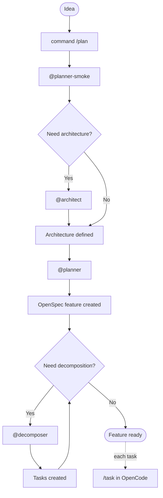
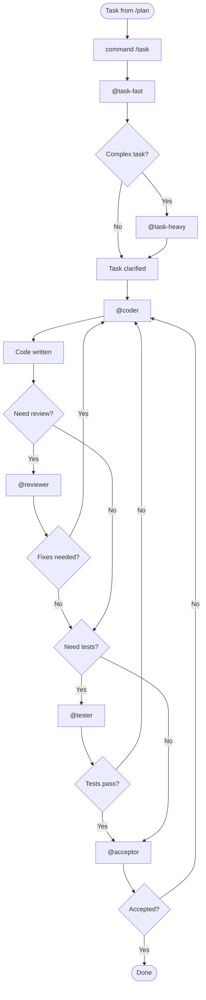
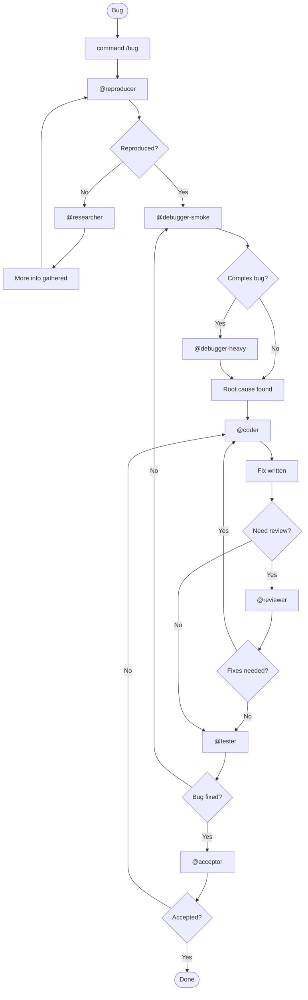

# Agentic Development Workflow Specification v4.1

> Spec-first development: Planning in Claude Code, execution in OpenCode workers.

## Overview

```
┌─────────────────────────────────────────────────────────────────────────────┐
│                              DEVELOPMENT FLOW                                │
│                                                                              │
│   /plan ──────────────────────►  /task, /bug ─────────────────────────────► │
│                                                                              │
│   ┌─────────────────────┐        ┌─────────────────────────────────────┐    │
│   │   CLAUDE CODE       │        │           OPENCODE                  │    │
│   │   (Driver)          │        │           (Worker)                  │    │
│   │                     │        │                                     │    │
│   │   Opus 4.5 (heavy)  │        │   GLM 4.7 (primary - high limits)   │    │
│   │   Sonnet 4.5        │        │   Kimi K2 Turbo (heavy - complex)   │    │
│   │   Haiku 4.5 (smoke) │        │                                     │    │
│   │                     │        │                                     │    │
│   │   Output:           │        │   Executes:                         │    │
│   │   OpenSpec features │        │   - Task implementation             │    │
│   │   with tasks        │        │   - Bug fixing                      │    │
│   └─────────────────────┘        └─────────────────────────────────────┘    │
└─────────────────────────────────────────────────────────────────────────────┘
```

**Key Principles:**

1. **Planning is Driver-only**: `/plan` runs entirely in Claude Code with full reasoning power
2. **Execution is delegated**: `/task` and `/bug` run in OpenCode workers
3. **GLM 4.7 is primary worker**: Huge limits make it ideal for bulk work
4. **Kimi K2 is heavy worker**: Reserved for complex problems (expensive, limited)

---

## Architecture

### Flow Separation

| Flow | Executor | Models | Output |
|------|----------|--------|--------|
| `/plan` | **Claude Code** | Opus, Sonnet, Haiku | OpenSpec features + tasks |
| `/task` | **OpenCode** | GLM 4.7 (primary), Kimi K2 (heavy) | Code, tests |
| `/bug` | **OpenCode** | GLM 4.7 (primary), Kimi K2 (heavy) | Fix, regression test |

### Model Strategy

```yaml
claude_code:
  # Full planning power - no cost constraints on thinking
  heavy: claude-opus-4-5-20250514      # Architecture, deep analysis
  standard: claude-sonnet-4-5-20250929  # Reviews, acceptance
  smoke: claude-haiku-4-5-20251001      # Quick assessments

opencode:
  # Execution workers - optimize for throughput
  primary: glm-4.7                      # High limits, good quality
  heavy: kimi-k2-thinking-turbo         # Complex cases only
  fallback: deepseek-coder              # When primary unavailable
```

### Why This Split?

| Concern | Claude Code | OpenCode (GLM) | OpenCode (Kimi) |
|---------|-------------|----------------|-----------------|
| **Cost** | Max subscription | Coder subscription | Coder subscription |
| **Limits** | Generous | **Very high** | Low |
| **Reasoning** | **Excellent** | Good | Good |
| **Speed** | Fast | Fast | Slower (thinking) |
| **Best for** | Planning, decisions | Bulk coding | Hard problems |

---

## Workflows

### /plan Flow (Claude Code Only)

Planning runs entirely in Claude Code to leverage Opus reasoning for architecture.



**Agents in /plan flow:**

| Agent | Model | Purpose |
|-------|-------|---------|
| @planner-smoke | Haiku 4.5 | Quick assessment: needs arch? |
| @architect | **Opus 4.5** | Full architecture design |
| @planner | Sonnet 4.5 | Feature specification |
| @decomposer | Sonnet 4.5 | Task breakdown |

**Output:** OpenSpec-compatible feature with tasks ready for execution.

---

### /task Flow (OpenCode Workers)

Task execution delegated to OpenCode with GLM 4.7 as primary.



**Agents in /task flow:**

| Agent | Model | When |
|-------|-------|------|
| @task-fast | GLM 4.7 | Always first |
| @task-heavy | **Kimi K2** | Complex tasks only |
| @coder | GLM 4.7 | Primary coding |
| @reviewer | GLM 4.7 | Code review |
| @tester | GLM 4.7 | Test creation |
| @acceptor | GLM 4.7 | Final check |

**Escalation to Kimi K2:**
- Task requires deep reasoning
- Multiple failed attempts with GLM
- Security-critical implementation
- Complex algorithm design

---

### /bug Flow (OpenCode Workers)

Bug fixing delegated to OpenCode with same model strategy.



**Agents in /bug flow:**

| Agent | Model | When |
|-------|-------|------|
| @reproducer | GLM 4.7 | Always first |
| @researcher | GLM 4.7 | Cannot reproduce |
| @debugger-smoke | GLM 4.7 | Initial investigation |
| @debugger-heavy | **Kimi K2** | Complex bugs only |
| @coder | GLM 4.7 | Fix implementation |
| @reviewer | GLM 4.7 | Review fix |
| @tester | GLM 4.7 | Verify fix |
| @acceptor | GLM 4.7 | Final acceptance |

**Escalation to Kimi K2:**
- Race conditions, deadlocks
- Memory leaks
- Intermittent/flaky behavior
- Multi-service interaction bugs
- Root cause not found after 2 attempts

---

## Commands

### /plan

**Executor:** Claude Code

| Attribute | Value |
|-----------|-------|
| **Syntax** | `/plan <idea>` |
| **Models** | Opus 4.5, Sonnet 4.5, Haiku 4.5 |
| **Output** | OpenSpec feature + task list |

**Example:**
```bash
/plan Add real-time notifications with WebSocket support
```

**Output structure:**
```yaml
# feature.openspec.yaml
feature:
  id: FEAT-001
  title: Real-time Notifications
  status: planned
  
architecture:
  type: event-driven
  components:
    - websocket-server
    - notification-service
    - event-bus
  
tasks:
  - id: TASK-001
    title: Implement WebSocket server
    complexity: M
    dependencies: []
    
  - id: TASK-002
    title: Create notification service
    complexity: M
    dependencies: [TASK-001]
    
  - id: TASK-003
    title: Add event bus integration
    complexity: S
    dependencies: [TASK-001]
```

---

### /task

**Executor:** OpenCode

| Attribute | Value |
|-----------|-------|
| **Syntax** | `/task <task-id>` or `/task <description>` |
| **Primary model** | GLM 4.7 |
| **Heavy model** | Kimi K2 Thinking Turbo |
| **Output** | Code, tests, documentation |

**Example:**
```bash
/task TASK-001
# or
/task Implement WebSocket server with connection management
```

---

### /bug

**Executor:** OpenCode

| Attribute | Value |
|-----------|-------|
| **Syntax** | `/bug <description>` |
| **Primary model** | GLM 4.7 |
| **Heavy model** | Kimi K2 Thinking Turbo |
| **Output** | Fix, regression test |

**Example:**
```bash
/bug WebSocket connections drop after 30 seconds of inactivity
```

---

## Agents

### Claude Code Agents (/plan flow)

#### @planner-smoke

| Attribute | Value |
|-----------|-------|
| **Model** | `claude-haiku-4-5-20251001` |
| **Purpose** | Quick assessment: does idea need architecture? |

```
You assess if an idea needs architectural design.

## Triggers for @architect:
- New system components
- Integration with external services
- Data model changes
- Security implications
- Performance requirements

## Output
- needs_architecture: true | false
- reason: string
```

---

#### @architect

| Attribute | Value |
|-----------|-------|
| **Model** | `claude-opus-4-5-20250514` |
| **Extended thinking** | ✅ Enabled |
| **Purpose** | Full architecture design |

```
You are a senior architect designing systems for implementation.

## Output: Architecture Decision Record

### Context
[Problem and constraints]

### Decision
[Chosen approach with rationale]

### Components
| Component | Responsibility | Tech |
|-----------|----------------|------|

### Data Model
[Entities, relationships]

### API Design
[Endpoints, contracts]

### Security
[Auth, threats, mitigations]

### Performance
[Targets, strategies]
```

---

#### @planner

| Attribute | Value |
|-----------|-------|
| **Model** | `claude-sonnet-4-5-20250929` |
| **Purpose** | Create OpenSpec feature specification |

```
You create OpenSpec-compatible feature specifications.

## Output Format
feature:
  id: FEAT-XXX
  title: string
  description: string
  status: planned
  
architecture_ref: ADR-XXX  # if exists

acceptance_criteria:
  - criterion 1
  - criterion 2
```

---

#### @decomposer

| Attribute | Value |
|-----------|-------|
| **Model** | `claude-sonnet-4-5-20250929` |
| **Purpose** | Break feature into executable tasks |

```
You decompose features into tasks for OpenCode execution.

## Rules
- Each task: 1-4 hours
- Clear acceptance criteria
- Minimal dependencies
- Specify stack/skills

## Output
tasks:
  - id: TASK-XXX
    title: string
    description: string
    acceptance_criteria:
      - criterion 1
    dependencies: [TASK-YYY]
    complexity: S | M | L | XL
    stack: go | node | react | ...
```

---

### OpenCode Agents (/task, /bug flows)

#### @task-fast

| Attribute | Value |
|-----------|-------|
| **Model** | `glm-4.7` |
| **Purpose** | Quick task assessment |

```
You assess task complexity for routing.

## Escalate to @task-heavy (Kimi K2) if:
- Complex algorithm design required
- Security-critical implementation
- Multiple integration points
- Unclear requirements after analysis

## Output
- complexity: LOW | HIGH
- decision: PROCEED | ESCALATE
- notes: string
```

---

#### @task-heavy

| Attribute | Value |
|-----------|-------|
| **Model** | `kimi-k2-thinking-turbo` |
| **Purpose** | Deep task analysis for complex cases |

```
You analyze complex tasks requiring deep reasoning.

## Responsibilities
- Clarify ambiguous requirements
- Design complex algorithms
- Plan security implementations
- Resolve architectural questions

## Output
- clarified_requirements: string
- implementation_approach: string
- risks: list
- recommendations: list
```

---

#### @coder

| Attribute | Value |
|-----------|-------|
| **Model** | `glm-4.7` |
| **Purpose** | Code implementation |

```
You implement production-quality code.

## Rules
- Follow specifications exactly
- Use project conventions
- Handle all errors
- No TODOs or placeholders
- No AI comments

## Stack-specific patterns
- Go: Clean Architecture, explicit errors
- Node: ESM, async/await, TypeScript
- React: Hooks, composition
- Vue: Composition API
```

---

#### @reviewer

| Attribute | Value |
|-----------|-------|
| **Model** | `glm-4.7` |
| **Purpose** | Code review |

```
You review code for quality and correctness.

## Check
- Logic errors
- Error handling
- Style violations
- Security basics
- Test coverage

## Output
- status: APPROVED | CHANGES_REQUESTED
- issues: list
- suggestions: list
```

---

#### @tester

| Attribute | Value |
|-----------|-------|
| **Model** | `glm-4.7` |
| **Purpose** | Test creation and execution |

```
You write and run tests.

## Approach
- Unit tests for functions
- Integration tests for components
- Table-driven tests
- Edge cases

## Output
- passed: X/Y
- coverage: XX%
- verdict: PASS | FAIL
```

---

#### @acceptor

| Attribute | Value |
|-----------|-------|
| **Model** | `glm-4.7` |
| **Purpose** | Final task acceptance |

```
You verify task completion.

## Checklist
- Requirements met
- Tests passing
- Coverage adequate
- No regressions

## Output
- decision: ACCEPTED | REJECTED
- reason: string (if rejected)
```

---

#### @reproducer

| Attribute | Value |
|-----------|-------|
| **Model** | `glm-4.7` |
| **Purpose** | Bug reproduction |

```
You reproduce reported bugs.

## Process
1. Analyze bug report
2. Create reproduction steps
3. Execute and verify
4. Document findings

## Output
- reproduced: true | false
- steps: list
- environment: string
- notes: string
```

---

#### @researcher

| Attribute | Value |
|-----------|-------|
| **Model** | `glm-4.7` |
| **Purpose** | Gather info for unclear bugs |

```
You research when bugs cannot be reproduced.

## Process
1. Analyze available info
2. Search codebase
3. Find similar issues
4. Formulate questions

## Output
- findings: string
- related_code: list
- questions: list
- recommendations: list
```

---

#### @debugger-smoke

| Attribute | Value |
|-----------|-------|
| **Model** | `glm-4.7` |
| **Purpose** | Initial bug investigation |

```
You perform initial bug analysis.

## Escalate to @debugger-heavy (Kimi K2) if:
- Race conditions suspected
- Memory issues
- Intermittent behavior
- Multi-service bug
- Root cause not found in 2 attempts

## Output
- complexity: LOW | HIGH
- decision: PROCEED | ESCALATE
- analysis: string (if proceeding)
```

---

#### @debugger-heavy

| Attribute | Value |
|-----------|-------|
| **Model** | `kimi-k2-thinking-turbo` |
| **Purpose** | Complex bug investigation |

```
You debug complex issues requiring deep analysis.

## Specializations
- Race conditions
- Memory leaks
- Distributed failures
- Performance issues

## Output
- root_cause: string
- affected_code: list
- fix_approach: string
- prevention: string
```

---

## Configuration

### Claude Code Config

```yaml
# claude-code-config.yaml

subscription: max

# /plan flow agents
agents:
  planner-smoke:
    model: claude-haiku-4-5-20251001
    max_tokens: 1024
    
  architect:
    model: claude-opus-4-5-20250514
    max_tokens: 16384
    extended_thinking: true
    thinking_budget: 32000
    
  planner:
    model: claude-sonnet-4-5-20250929
    max_tokens: 8192
    
  decomposer:
    model: claude-sonnet-4-5-20250929
    max_tokens: 8192

# Output format
output:
  format: openspec
  version: "1.0"
```

### OpenCode Config

```yaml
# opencode.yaml

# Primary provider - high limits
provider: zhipu
model: glm-4.7

# Provider configs
providers:
  zhipu:
    apiKey: ${ZHIPU_API_KEY}
    baseURL: https://open.bigmodel.cn/api/paas/v4
    model: glm-4.7
    
  kimi:
    apiKey: ${MOONSHOT_API_KEY}
    baseURL: https://api.moonshot.cn/v1
    model: kimi-k2-thinking-turbo
    
  openrouter:
    apiKey: ${OPENROUTER_API_KEY}
    model: deepseek/deepseek-coder

# Agent model overrides
agents:
  # Most agents use primary (GLM 4.7)
  default:
    provider: zhipu
    model: glm-4.7
  
  # Heavy agents use Kimi K2
  task-heavy:
    provider: kimi
    model: kimi-k2-thinking-turbo
    
  debugger-heavy:
    provider: kimi
    model: kimi-k2-thinking-turbo

# Escalation rules
escalation:
  max_retries_before_heavy: 2
  heavy_triggers:
    - keyword: "race condition"
    - keyword: "deadlock"
    - keyword: "memory leak"
    - complexity_score: "> 0.8"
```

### Model Limits Reference

| Model | Provider | Context | Rate Limit | Best For |
|-------|----------|---------|------------|----------|
| claude-opus-4-5 | Anthropic | 200K | Max sub | Heavy reasoning |
| claude-sonnet-4-5 | Anthropic | 200K | Max sub | Standard tasks |
| claude-haiku-4-5 | Anthropic | 200K | Max sub | Quick checks |
| **glm-4.7** | Z.ai | 128K | **Very high** | **Bulk work** |
| kimi-k2-turbo | Kimi | 128K | Limited | Hard problems |
| deepseek-coder | OpenRouter | 128K | Pay-per-use | Fallback |

---

## Skills

### Skill Assignment

| Agent | Required Skills |
|-------|-----------------|
| @architect | arch-core, api-design, security-core |
| @planner | arch-core |
| @decomposer | arch-core |
| @coder | stack-specific (auto-detected) |
| @reviewer | review-core, stack-specific |
| @tester | test-specific (auto-detected) |
| @debugger-* | debug-core, stack-specific |

### Skill Categories

```
skills/
├── core/
│   ├── arch-core/
│   ├── api-design/
│   ├── security-core/
│   ├── review-core/
│   └── debug-core/
│
├── go/
│   ├── go-arch/
│   ├── go-code/
│   ├── go-test/
│   └── ...
│
├── fullstack/
│   ├── node-core/
│   ├── react/
│   ├── vue/
│   └── ...
│
├── scripts/
│   ├── bash/
│   ├── makefile/
│   └── ...
│
└── devops/
    ├── docker/
    ├── kubernetes/
    └── ...
```

---

## Usage Examples

### Example 1: New Feature

```bash
# Step 1: Plan in Claude Code
/plan Add WebSocket notifications for order updates

# Claude Code (Opus) creates:
# - Architecture decision record
# - OpenSpec feature spec
# - 5 tasks with dependencies

# Step 2: Execute tasks in OpenCode
/task TASK-001  # WebSocket server (GLM 4.7)
/task TASK-002  # Notification service (GLM 4.7)
/task TASK-003  # Event handlers (GLM 4.7)
# ... etc
```

**Cost breakdown:**
- Planning (Claude Code): ~$2-5 (Opus thinking)
- Execution (OpenCode): Subscription (GLM 4.7)

---

### Example 2: Simple Bug Fix

```bash
/bug User avatar not displaying after upload

# OpenCode flow:
# 1. @reproducer (GLM) - reproduces issue
# 2. @debugger-smoke (GLM) - finds missing content-type
# 3. @coder (GLM) - fixes header handling
# 4. @tester (GLM) - adds regression test
# 5. @acceptor (GLM) - approves

# All GLM 4.7 - subscription only
```

---

### Example 3: Complex Bug (Escalation)

```bash
/bug Intermittent deadlock in payment processing

# OpenCode flow:
# 1. @reproducer (GLM) - reproduces sometimes
# 2. @debugger-smoke (GLM) - suspects race condition
# 3. → ESCALATE to @debugger-heavy
# 4. @debugger-heavy (Kimi K2) - finds mutex ordering issue
# 5. @coder (GLM) - implements fix
# 6. @tester (GLM) - stress tests
# 7. @acceptor (GLM) - approves
```

**Cost:** Subscription (GLM) + Kimi K2 for debugging only

---

## Metrics

### Track by Executor

```yaml
claude_code_metrics:
  - plan_count
  - opus_tokens
  - sonnet_tokens
  - haiku_tokens
  - features_created
  - tasks_generated

opencode_metrics:
  - task_count
  - bug_count
  - glm_requests
  - kimi_requests (escalations)
  - fallback_requests
  - completion_rate
  - rework_cycles
```

### Optimization Targets

| Metric | Target |
|--------|--------|
| Planning success rate | > 95% |
| Task first-time acceptance | > 80% |
| Escalation to Kimi K2 | < 15% |
| GLM fallback to DeepSeek | < 5% |

---

## Migration & Updates

### Updating Models

```yaml
# When new model releases:

# 1. Update Claude Code config
agents:
  architect:
    model: claude-opus-4-6-YYYYMMDD  # new

# 2. Update OpenCode config  
providers:
  zhipu:
    model: glm-5.0  # new
    
  kimi:
    model: kimi-k3-turbo  # new
```

### Switching Workers

```yaml
# From OpenCode to Crush (example)
worker:
  tool: crush  # was: opencode
  
crush:
  primary:
    provider: zhipu
    model: glm-4.7
  heavy:
    provider: kimi
    model: kimi-k2-thinking-turbo
```