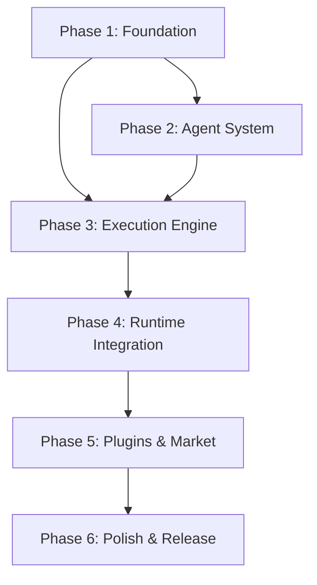

# GoEnt Migration Plan: Multi-Agent Architecture

## Migration Plan v3.0

**Version**: 3.0  
**Author**: Architecture Team  
**Date**: January 2026  
**Status**: Approved  

---

## 1. Executive Summary

This document outlines the migration strategy to transform **go-ent** from a simple spec-driven MCP server into a comprehensive **multi-agent orchestration platform**. The migration consolidates rules, agents, skills, plugins, and marketplace into a single repository while adding support for both Claude Code and OpenCode execution.

### 1.1 Current State

```
go-ent/
├── cmd/go-ent/              # MCP server (spec management only)
├── openspec/               # Local OpenSpec integration
├── plugins/go-ent/         # Claude Code plugin config
├── templates/              # Code patterns (unused by MCP)
├── .claude/commands/       # Slash commands
├── .serena/               # Legacy serena config
└── user-claude-md/        # User CLAUDE.md templates
```

### 1.2 Target State

```
go-ent/
├── cmd/
│   ├── goent/              # MCP server + CLI
│   └── goent-worker/       # Agent worker process
├── internal/
│   ├── domain/             # Core domain types
│   ├── spec/               # Spec management
│   ├── agent/              # Agent orchestration
│   ├── execution/          # Execution engine
│   └── mcp/                # MCP server
├── agents/                 # Agent role definitions
├── skills/                 # Agent skills library
├── rules/                  # Enterprise standards
├── plugins/                # IDE plugins
│   ├── claude-code/
│   └── opencode/
├── market/                 # Marketplace definitions
└── openspec/               # OpenSpec templates
```

---

## 2. Migration Phases

### Phase Overview

```
┌─────────────────────────────────────────────────────────────────────┐
│                      MIGRATION TIMELINE                             │
├─────────────────────────────────────────────────────────────────────┤
│                                                                     │
│  PHASE 1: Foundation (Week 1-2)                                     │
│  ├── Restructure repository                                         │
│  ├── Define domain types                                            │
│  └── Extract existing functionality                                 │
│                                                                     │
│  PHASE 2: Agent System (Week 3-4)                                   │
│  ├── Create agent role definitions                                  │
│  ├── Build skill library                                            │
│  └── Implement agent selection                                      │
│                                                                     │
│  PHASE 3: Execution Engine (Week 5-6)                               │
│  ├── Single agent execution                                         │
│  ├── Multi-agent orchestration                                      │
│  └── Parallel execution support                                     │
│                                                                     │
│  PHASE 4: Runtime Integration (Week 7-8)                            │
│  ├── Claude Code integration                                        │
│  ├── OpenCode integration                                           │
│  └── CLI standalone mode                                            │
│                                                                     │
│  PHASE 5: Plugins & Market (Week 9-10)                              │
│  ├── Plugin system                                                  │
│  ├── Rules marketplace                                              │
│  └── Skills marketplace                                             │
│                                                                     │
│  PHASE 6: Polish & Release (Week 11-12)                             │
│  ├── Documentation                                                  │
│  ├── Testing                                                        │
│  └── Release v3.0                                                   │
│                                                                     │
└─────────────────────────────────────────────────────────────────────┘
```

---

## 3. Phase 1: Foundation

### 3.1 Repository Structure

Create the new directory structure while preserving existing functionality:

```bash
# Create new directories
mkdir -p cmd/go-ent-worker
mkdir -p internal/{domain,spec,agent,execution,mcp,config}
mkdir -p agents/{prompts,roles}
mkdir -p skills/{review,patterns,testing,architecture}
mkdir -p rules/{enterprise,go-idioms,clean-arch}
mkdir -p plugins/{claude-code,opencode}
mkdir -p market/{agents,skills,rules}
mkdir -p pkg/{openspec,runtime}

# Move existing code
mv cmd/go-ent/internal/* internal/
mv openspec/ pkg/openspec/templates/
mv templates/ pkg/templates/
mv .claude/ plugins/claude-code/commands/
mv plugins/go-ent/.claude-plugin plugins/claude-code/
```

### 3.2 Domain Types

Create core domain types in `internal/domain/`:

```go
// internal/domain/action.go
package domain

type SpecAction string

const (
    ActionResearch   SpecAction = "research"
    ActionAnalyze    SpecAction = "analyze"
    ActionRetrofit   SpecAction = "retrofit"
    ActionProposal   SpecAction = "proposal"
    ActionPlan       SpecAction = "plan"
    ActionDesign     SpecAction = "design"
    ActionSplit      SpecAction = "split"
    ActionImplement  SpecAction = "implement"
    ActionExecute    SpecAction = "execute"
    ActionScaffold   SpecAction = "scaffold"
    ActionReview     SpecAction = "review"
    ActionVerify     SpecAction = "verify"
    ActionDebug      SpecAction = "debug"
    ActionLint       SpecAction = "lint"
    ActionApprove    SpecAction = "approve"
    ActionArchive    SpecAction = "archive"
    ActionStatus     SpecAction = "status"
)

func (a SpecAction) Phase() ActionPhase {
    switch a {
    case ActionResearch, ActionAnalyze, ActionRetrofit:
        return PhaseDiscovery
    case ActionProposal, ActionPlan, ActionDesign, ActionSplit:
        return PhasePlanning
    case ActionImplement, ActionExecute, ActionScaffold:
        return PhaseExecution
    case ActionReview, ActionVerify, ActionDebug, ActionLint:
        return PhaseValidation
    case ActionApprove, ActionArchive, ActionStatus:
        return PhaseLifecycle
    default:
        return PhaseUnknown
    }
}
```

```go
// internal/domain/agent.go
package domain

type AgentRole string

const (
    RoleProduct   AgentRole = "product"
    RoleArchitect AgentRole = "architect"
    RoleSenior    AgentRole = "senior"
    RoleDeveloper AgentRole = "developer"
    RoleReviewer  AgentRole = "reviewer"
    RoleOps       AgentRole = "ops"
)

type AgentConfig struct {
    Runtime      Runtime   `json:"runtime" yaml:"runtime"`
    Model        string    `json:"model" yaml:"model"`
    Role         AgentRole `json:"role" yaml:"role"`
    Roles        []AgentRole `json:"roles,omitempty" yaml:"roles,omitempty"`
    Skills       []string  `json:"skills,omitempty" yaml:"skills,omitempty"`
    ContextFiles []string  `json:"context_files,omitempty" yaml:"context_files,omitempty"`
    Temperature  float64   `json:"temperature,omitempty" yaml:"temperature,omitempty"`
    MaxTokens    int       `json:"max_tokens,omitempty" yaml:"max_tokens,omitempty"`
}

type Runtime string

const (
    RuntimeClaudeCode Runtime = "claude-code"
    RuntimeOpenCode   Runtime = "opencode"
    RuntimeCLI        Runtime = "cli"
)
```

```go
// internal/domain/execution.go
package domain

import "time"

type ExecutionID string

type Execution struct {
    ID          ExecutionID       `json:"id"`
    Action      SpecAction        `json:"action"`
    ChangeID    string            `json:"change_id,omitempty"`
    TaskIDs     []string          `json:"task_ids,omitempty"`
    Strategy    ExecutionStrategy `json:"strategy"`
    Agents      []AgentConfig     `json:"agents"`
    Steps       []ExecutionStep   `json:"steps"`
    Status      ExecutionStatus   `json:"status"`
    Error       string            `json:"error,omitempty"`
    StartedAt   time.Time         `json:"started_at"`
    CompletedAt *time.Time        `json:"completed_at,omitempty"`
    Cost        CostEstimate      `json:"cost"`
}

type ExecutionStrategy string

const (
    StrategySingle   ExecutionStrategy = "single"
    StrategyMulti    ExecutionStrategy = "multi"
    StrategyParallel ExecutionStrategy = "parallel"
)

type ExecutionStatus string

const (
    StatusQueued    ExecutionStatus = "queued"
    StatusRunning   ExecutionStatus = "running"
    StatusCompleted ExecutionStatus = "completed"
    StatusFailed    ExecutionStatus = "failed"
    StatusCancelled ExecutionStatus = "cancelled"
)

type ExecutionStep struct {
    ID        string          `json:"id"`
    Agent     AgentConfig     `json:"agent"`
    TaskID    string          `json:"task_id,omitempty"`
    Input     string          `json:"input"`
    Output    string          `json:"output,omitempty"`
    Status    ExecutionStatus `json:"status"`
    Error     string          `json:"error,omitempty"`
    StartedAt time.Time       `json:"started_at"`
    Duration  time.Duration   `json:"duration"`
    Tokens    TokenUsage      `json:"tokens"`
}

type TokenUsage struct {
    Input    int `json:"input"`
    Output   int `json:"output"`
    Cached   int `json:"cached"`
    Thinking int `json:"thinking,omitempty"`
}

type CostEstimate struct {
    EstimatedUSD float64    `json:"estimated_usd"`
    ActualUSD    float64    `json:"actual_usd,omitempty"`
    Breakdown    []CostItem `json:"breakdown,omitempty"`
}

type CostItem struct {
    Model   string  `json:"model"`
    Tokens  int     `json:"tokens"`
    CostUSD float64 `json:"cost_usd"`
}
```

### 3.3 Configuration System

```go
// internal/config/config.go
package config

import (
    "os"
    "path/filepath"

    "gopkg.in/yaml.v3"
)

type Config struct {
    Project   ProjectConfig   `yaml:"project"`
    TechStack TechStackConfig `yaml:"tech_stack"`
    Commands  CommandsConfig  `yaml:"commands"`
    OpenSpec  OpenSpecConfig  `yaml:"openspec"`
    Agents    AgentsConfig    `yaml:"agents"`
    Standards StandardsConfig `yaml:"standards"`
}

type ProjectConfig struct {
    Name       string `yaml:"name"`
    Type       string `yaml:"type"`
    Repository string `yaml:"repository"`
}

type AgentsConfig struct {
    Models   ModelsConfig   `yaml:"models"`
    Runtimes RuntimesConfig `yaml:"runtimes"`
    Budget   BudgetConfig   `yaml:"budget"`
}

type ModelsConfig struct {
    HighReasoning string `yaml:"high_reasoning"`
    Balanced      string `yaml:"balanced"`
    Fast          string `yaml:"fast"`
}

type RuntimesConfig struct {
    Planning       string `yaml:"planning"`
    Implementation string `yaml:"implementation"`
    Review         string `yaml:"review"`
}

type BudgetConfig struct {
    PerExecution  float64 `yaml:"per_execution"`
    PerDay        float64 `yaml:"per_day"`
    WarnThreshold float64 `yaml:"warn_threshold"`
}

func Load(path string) (*Config, error) {
    data, err := os.ReadFile(path)
    if err != nil {
        return DefaultConfig(), nil
    }
    
    var cfg Config
    if err := yaml.Unmarshal(data, &cfg); err != nil {
        return nil, err
    }
    
    return &cfg, nil
}

func DefaultConfig() *Config {
    return &Config{
        Agents: AgentsConfig{
            Models: ModelsConfig{
                HighReasoning: "claude-opus-4-5",
                Balanced:      "claude-sonnet-4-5",
                Fast:          "glm-4.7",
            },
            Runtimes: RuntimesConfig{
                Planning:       "claude-code",
                Implementation: "opencode",
                Review:         "claude-code",
            },
            Budget: BudgetConfig{
                PerExecution:  1.0,
                PerDay:        10.0,
                WarnThreshold: 0.5,
            },
        },
    }
}
```

### 3.4 Tasks

| Task | Description | Estimate |
|------|-------------|----------|
| 1.1 | Create directory structure | 2h |
| 1.2 | Move existing code to new locations | 4h |
| 1.3 | Define domain types (action, agent, execution) | 8h |
| 1.4 | Implement configuration system | 6h |
| 1.5 | Update imports and fix build | 4h |
| 1.6 | Add unit tests for domain types | 4h |

**Total Phase 1**: ~28 hours (1 week)

---

## 4. Phase 2: Agent System

### 4.1 Agent Role Definitions

Create role-specific prompts and configurations:

```yaml
# agents/roles/architect.yaml
id: architect
name: "Solution Architect"
description: "Designs system architecture and makes technical decisions"

system_prompt: |
  You are a Solution Architect specializing in Go backend systems.
  
  Your responsibilities:
  - Design clean, maintainable architectures
  - Make technology and pattern decisions
  - Ensure SOLID principles are followed
  - Consider scalability and performance
  - Document technical decisions
  
  Your approach:
  - Start with domain modeling
  - Prefer composition over inheritance
  - Design for testability
  - Keep dependencies pointing inward
  - Use interfaces at boundaries

capabilities:
  - system_design
  - technology_selection
  - pattern_application
  - trade_off_analysis
  - documentation

best_for_actions:
  - proposal
  - plan
  - design
  - split

temperature: 0.7
prefer_models:
  - claude-opus-4-5
  - claude-sonnet-4-5
```

```yaml
# agents/roles/senior.yaml
id: senior
name: "Senior Go Developer"
description: "Implements complex features with enterprise standards"

system_prompt: |
  You are a Senior Go Developer with expertise in:
  - Clean Architecture patterns
  - Enterprise Go development
  - High-performance systems
  - Comprehensive testing
  
  Your standards:
  - Variables: short, idiomatic (cfg, repo, srv)
  - Errors: lowercase, wrapped with context
  - Interfaces: defined at consumer side
  - Tests: table-driven, parallel where safe
  
  Your workflow:
  - Understand requirements first
  - Consider edge cases
  - Write tests alongside code
  - Document non-obvious decisions

capabilities:
  - implementation
  - debugging
  - optimization
  - testing
  - code_review

best_for_actions:
  - implement
  - debug
  - plan

temperature: 0.3
prefer_models:
  - claude-sonnet-4-5
  - glm-4.7
```

```yaml
# agents/roles/developer.yaml
id: developer
name: "Go Developer"
description: "Implements features following established patterns"

system_prompt: |
  You are a Go Developer focused on:
  - Clean, readable code
  - Following established patterns
  - Comprehensive error handling
  - Good test coverage
  
  Your approach:
  - Follow existing code conventions
  - Ask clarifying questions when unclear
  - Write tests for new code
  - Keep functions small and focused

capabilities:
  - implementation
  - testing
  - refactoring

best_for_actions:
  - implement
  - execute
  - scaffold

temperature: 0.2
prefer_models:
  - glm-4.7
  - claude-sonnet-4-5
```

```yaml
# agents/roles/reviewer.yaml
id: reviewer
name: "Code Reviewer"
description: "Reviews code for quality, security, and standards"

system_prompt: |
  You are a Code Reviewer specializing in Go enterprise applications.
  
  Review checklist:
  - [ ] Clean Architecture compliance
  - [ ] SOLID principles
  - [ ] Error handling patterns
  - [ ] Test coverage and quality
  - [ ] Security considerations
  - [ ] Performance implications
  - [ ] Documentation completeness
  
  Your feedback style:
  - Constructive and actionable
  - Reference specific patterns
  - Suggest alternatives, don't just criticize
  - Prioritize: blockers > suggestions > nitpicks

capabilities:
  - code_review
  - security_analysis
  - performance_review
  - standards_enforcement

best_for_actions:
  - review
  - verify
  - lint

temperature: 0.5
prefer_models:
  - claude-opus-4-5
  - claude-sonnet-4-5
```

### 4.2 Skills Library

Create reusable skills that agents can utilize:

```yaml
# skills/review/enterprise-standards.yaml
id: enterprise-standards
name: "Enterprise Go Standards"
description: "Review code against enterprise Go standards"
category: review
version: "1.0.0"

triggers:
  - "review code"
  - "check quality"
  - "enterprise standards"

applicable_roles:
  - reviewer
  - senior
  - architect

checklist:
  architecture:
    - "Domain has zero external dependencies"
    - "Interfaces defined at consumer side"
    - "Repository uses private models with mappers"
    - "Transport layer handles HTTP concerns only"
  
  naming:
    - "Variables use short idiomatic names (cfg, repo, srv)"
    - "Constructors follow New() pattern"
    - "Structs are private by default"
  
  errors:
    - "Errors are lowercase without punctuation"
    - "Context provided via fmt.Errorf wrapping"
    - "Custom error types for domain errors"
  
  testing:
    - "Table-driven tests used"
    - "Tests are parallel where safe"
    - "Mocks generated via interfaces"

prompt_template: |
  Review the following code against enterprise Go standards.
  
  Use this checklist:
  {{range .checklist}}
  ## {{.category | title}}
  {{range .items}}
  - {{.}}
  {{end}}
  {{end}}
  
  Code to review:
  ```go
  {{.code}}
  ```
  
  Provide feedback in this format:
  - BLOCKER: [issue] - [suggestion]
  - SUGGESTION: [issue] - [suggestion]
  - NITPICK: [issue] - [suggestion]
```

```yaml
# skills/patterns/clean-architecture.yaml
id: clean-architecture
name: "Clean Architecture Patterns"
description: "Generate code following Clean Architecture"
category: patterns
version: "1.0.0"

triggers:
  - "create repository"
  - "implement handler"
  - "new service"

applicable_roles:
  - developer
  - senior
  - architect

templates:
  domain_entity: |
    package {{.package}}
    
    // {{.name}} represents {{.description}}.
    type {{.name}} struct {
        ID        {{.id_type}}
        {{range .fields}}
        {{.name | title}} {{.type}} `json:"{{.name | snake}}"`
        {{end}}
        CreatedAt time.Time
        UpdatedAt time.Time
    }
  
  repository_interface: |
    package {{.package}}
    
    // {{.name}}Repository defines the contract for {{.name | lower}} persistence.
    type {{.name}}Repository interface {
        Get(ctx context.Context, id {{.id_type}}) (*{{.name}}, error)
        List(ctx context.Context, filter {{.name}}Filter) ([]*{{.name}}, error)
        Create(ctx context.Context, entity *{{.name}}) error
        Update(ctx context.Context, entity *{{.name}}) error
        Delete(ctx context.Context, id {{.id_type}}) error
    }
  
  usecase: |
    package {{.package}}
    
    type {{.name}}UseCase struct {
        repo {{.name}}Repository
        log  *slog.Logger
    }
    
    func New{{.name}}UseCase(repo {{.name}}Repository, log *slog.Logger) *{{.name}}UseCase {
        return &{{.name}}UseCase{repo: repo, log: log}
    }
```

```yaml
# skills/testing/table-driven.yaml
id: table-driven-tests
name: "Table-Driven Tests"
description: "Generate table-driven test patterns"
category: testing
version: "1.0.0"

triggers:
  - "write tests"
  - "add test"
  - "test coverage"

applicable_roles:
  - developer
  - senior

template: |
  func Test{{.function_name}}(t *testing.T) {
      t.Parallel()
      
      tests := []struct {
          name    string
          {{range .inputs}}
          {{.name}} {{.type}}
          {{end}}
          {{if .has_output}}
          want    {{.output_type}}
          {{end}}
          wantErr bool
      }{
          {{range .cases}}
          {
              name: "{{.name}}",
              {{range .inputs}}
              {{.name}}: {{.value}},
              {{end}}
              {{if $.has_output}}
              want: {{.expected}},
              {{end}}
              wantErr: {{.want_err}},
          },
          {{end}}
      }
      
      for _, tt := range tests {
          t.Run(tt.name, func(t *testing.T) {
              t.Parallel()
              
              {{if .has_output}}
              got, err := {{.receiver}}{{.function_name}}({{.args}})
              {{else}}
              err := {{.receiver}}{{.function_name}}({{.args}})
              {{end}}
              
              if (err != nil) != tt.wantErr {
                  t.Errorf("{{.function_name}}() error = %v, wantErr %v", err, tt.wantErr)
                  return
              }
              {{if .has_output}}
              if !reflect.DeepEqual(got, tt.want) {
                  t.Errorf("{{.function_name}}() = %v, want %v", got, tt.want)
              }
              {{end}}
          })
      }
  }
```

### 4.3 Agent Selection Service

```go
// internal/agent/selector.go
package agent

import (
    "context"
    
    "github.com/victorzhuk/go-ent/internal/domain"
    "github.com/victorzhuk/go-ent/internal/config"
)

type Selector struct {
    matrix   *ActionMatrix
    config   *config.Config
    analyzer *ComplexityAnalyzer
}

func NewSelector(cfg *config.Config) *Selector {
    return &Selector{
        matrix:   LoadDefaultMatrix(),
        config:   cfg,
        analyzer: NewComplexityAnalyzer(),
    }
}

type SelectionResult struct {
    Primary   domain.AgentConfig
    Fallback  *domain.AgentConfig
    Strategy  domain.ExecutionStrategy
    Reasoning string
}

func (s *Selector) Select(ctx context.Context, req SelectionRequest) (*SelectionResult, error) {
    // 1. Get default mapping for action
    mapping := s.matrix.Get(req.Action)
    if mapping == nil {
        return nil, ErrUnknownAction
    }
    
    // 2. Analyze complexity if change context provided
    var complexity *ComplexityResult
    if req.ChangeContext != nil {
        complexity = s.analyzer.Analyze(req.ChangeContext)
    }
    
    // 3. Apply complexity-based adjustments
    result := s.applyComplexityAdjustments(mapping, complexity)
    
    // 4. Apply user preferences
    result = s.applyUserPreferences(result, req.Options)
    
    // 5. Apply budget constraints
    result = s.applyBudgetConstraints(result)
    
    return result, nil
}

func (s *Selector) applyComplexityAdjustments(
    mapping *ActionMapping,
    complexity *ComplexityResult,
) *SelectionResult {
    result := &SelectionResult{
        Primary:  mapping.Primary,
        Fallback: mapping.Fallback,
        Strategy: mapping.Strategy,
    }
    
    if complexity == nil {
        return result
    }
    
    // For simple changes, use faster/cheaper models
    if complexity.Level == ComplexityLow {
        if mapping.Fallback != nil {
            result.Primary = *mapping.Fallback
            result.Reasoning = "Using faster model for low-complexity change"
        }
    }
    
    // For complex changes, ensure high-reasoning model
    if complexity.Level == ComplexityHigh {
        if result.Primary.Model != s.config.Agents.Models.HighReasoning {
            result.Primary.Model = s.config.Agents.Models.HighReasoning
            result.Reasoning = "Upgraded to high-reasoning model for complex change"
        }
    }
    
    return result
}
```

### 4.4 Tasks

| Task | Description | Estimate |
|------|-------------|----------|
| 2.1 | Create agent role definitions (5 roles) | 8h |
| 2.2 | Build skill library structure | 6h |
| 2.3 | Implement skill loader | 4h |
| 2.4 | Create enterprise standards skill | 4h |
| 2.5 | Create clean architecture skill | 4h |
| 2.6 | Create table-driven tests skill | 2h |
| 2.7 | Implement agent selector service | 8h |
| 2.8 | Add complexity analyzer | 6h |
| 2.9 | Unit tests for agent system | 6h |

**Total Phase 2**: ~48 hours (1.5 weeks)

---

## 5. Phase 3: Execution Engine

### 5.1 Execution Service

```go
// internal/execution/service.go
package execution

import (
    "context"
    "sync"
    
    "github.com/victorzhuk/go-ent/internal/domain"
    "github.com/victorzhuk/go-ent/internal/agent"
)

type Service struct {
    selector *agent.Selector
    runners  map[domain.Runtime]Runner
    store    ExecutionStore
}

type Runner interface {
    Run(ctx context.Context, config domain.AgentConfig, input string) (*RunResult, error)
}

type RunResult struct {
    Output string
    Tokens domain.TokenUsage
    Error  error
}

func (s *Service) Execute(ctx context.Context, req ExecuteRequest) (*domain.Execution, error) {
    // 1. Create execution record
    exec := &domain.Execution{
        ID:        domain.ExecutionID(generateID()),
        Action:    req.Action,
        ChangeID:  req.ChangeID,
        TaskIDs:   req.TaskIDs,
        Status:    domain.StatusQueued,
        StartedAt: time.Now(),
    }
    
    // 2. Select agents
    selection, err := s.selector.Select(ctx, agent.SelectionRequest{
        Action:        req.Action,
        ChangeContext: req.ChangeContext,
        Options:       req.Options,
    })
    if err != nil {
        return nil, fmt.Errorf("select agents: %w", err)
    }
    
    exec.Agents = []domain.AgentConfig{selection.Primary}
    if selection.Fallback != nil {
        exec.Agents = append(exec.Agents, *selection.Fallback)
    }
    exec.Strategy = selection.Strategy
    
    // 3. Execute based on strategy
    switch selection.Strategy {
    case domain.StrategySingle:
        return s.executeSingle(ctx, exec, selection)
    case domain.StrategyMulti:
        return s.executeMulti(ctx, exec, selection)
    case domain.StrategyParallel:
        return s.executeParallel(ctx, exec, selection, req.Options.MaxWorkers)
    default:
        return nil, ErrUnknownStrategy
    }
}

func (s *Service) executeSingle(
    ctx context.Context,
    exec *domain.Execution,
    selection *agent.SelectionResult,
) (*domain.Execution, error) {
    exec.Status = domain.StatusRunning
    
    runner := s.runners[selection.Primary.Runtime]
    result, err := runner.Run(ctx, selection.Primary, exec.Input)
    
    step := domain.ExecutionStep{
        ID:        generateStepID(),
        Agent:     selection.Primary,
        Status:    domain.StatusCompleted,
        StartedAt: time.Now(),
    }
    
    if err != nil {
        // Try fallback if available
        if selection.Fallback != nil {
            runner = s.runners[selection.Fallback.Runtime]
            result, err = runner.Run(ctx, *selection.Fallback, exec.Input)
            step.Agent = *selection.Fallback
        }
        
        if err != nil {
            step.Status = domain.StatusFailed
            step.Error = err.Error()
            exec.Status = domain.StatusFailed
            exec.Error = err.Error()
        }
    }
    
    if result != nil {
        step.Output = result.Output
        step.Tokens = result.Tokens
    }
    
    step.Duration = time.Since(step.StartedAt)
    exec.Steps = append(exec.Steps, step)
    
    if exec.Status != domain.StatusFailed {
        exec.Status = domain.StatusCompleted
    }
    
    now := time.Now()
    exec.CompletedAt = &now
    
    return exec, nil
}

func (s *Service) executeParallel(
    ctx context.Context,
    exec *domain.Execution,
    selection *agent.SelectionResult,
    maxWorkers int,
) (*domain.Execution, error) {
    if maxWorkers <= 0 {
        maxWorkers = 3
    }
    
    exec.Status = domain.StatusRunning
    
    // Build task dependency graph
    graph := buildDependencyGraph(exec.TaskIDs)
    
    // Execute in waves
    var mu sync.Mutex
    sem := make(chan struct{}, maxWorkers)
    
    for _, wave := range graph.Waves() {
        var wg sync.WaitGroup
        
        for _, taskID := range wave {
            wg.Add(1)
            sem <- struct{}{} // Acquire worker slot
            
            go func(tid string) {
                defer wg.Done()
                defer func() { <-sem }() // Release worker slot
                
                runner := s.runners[selection.Primary.Runtime]
                result, err := runner.Run(ctx, selection.Primary, tid)
                
                step := domain.ExecutionStep{
                    ID:        generateStepID(),
                    Agent:     selection.Primary,
                    TaskID:    tid,
                    StartedAt: time.Now(),
                }
                
                if err != nil {
                    step.Status = domain.StatusFailed
                    step.Error = err.Error()
                } else {
                    step.Status = domain.StatusCompleted
                    step.Output = result.Output
                    step.Tokens = result.Tokens
                }
                
                step.Duration = time.Since(step.StartedAt)
                
                mu.Lock()
                exec.Steps = append(exec.Steps, step)
                mu.Unlock()
            }(taskID)
        }
        
        wg.Wait()
    }
    
    // Check for failures
    for _, step := range exec.Steps {
        if step.Status == domain.StatusFailed {
            exec.Status = domain.StatusFailed
            break
        }
    }
    
    if exec.Status != domain.StatusFailed {
        exec.Status = domain.StatusCompleted
    }
    
    now := time.Now()
    exec.CompletedAt = &now
    
    return exec, nil
}
```

### 5.2 Runtime Runners

```go
// internal/execution/runner_claude.go
package execution

import (
    "context"
    "os/exec"
    
    "github.com/victorzhuk/go-ent/internal/domain"
)

type ClaudeCodeRunner struct {
    workDir string
}

func NewClaudeCodeRunner(workDir string) *ClaudeCodeRunner {
    return &ClaudeCodeRunner{workDir: workDir}
}

func (r *ClaudeCodeRunner) Run(
    ctx context.Context,
    config domain.AgentConfig,
    input string,
) (*RunResult, error) {
    // Build prompt with role and skills
    prompt := r.buildPrompt(config, input)
    
    // Execute via claude CLI
    cmd := exec.CommandContext(ctx, "claude",
        "--model", config.Model,
        "--prompt", prompt,
        "--output-format", "json",
    )
    cmd.Dir = r.workDir
    
    output, err := cmd.Output()
    if err != nil {
        return nil, fmt.Errorf("claude execution: %w", err)
    }
    
    var response ClaudeResponse
    if err := json.Unmarshal(output, &response); err != nil {
        return nil, fmt.Errorf("parse response: %w", err)
    }
    
    return &RunResult{
        Output: response.Content,
        Tokens: domain.TokenUsage{
            Input:  response.Usage.InputTokens,
            Output: response.Usage.OutputTokens,
            Cached: response.Usage.CacheReadTokens,
        },
    }, nil
}

func (r *ClaudeCodeRunner) buildPrompt(config domain.AgentConfig, input string) string {
    var sb strings.Builder
    
    // Add role system prompt
    role := LoadRole(config.Role)
    sb.WriteString(role.SystemPrompt)
    sb.WriteString("\n\n")
    
    // Add skills
    for _, skillID := range config.Skills {
        skill := LoadSkill(skillID)
        sb.WriteString(skill.PromptTemplate)
        sb.WriteString("\n\n")
    }
    
    // Add input
    sb.WriteString("## Task\n")
    sb.WriteString(input)
    
    return sb.String()
}
```

```go
// internal/execution/runner_opencode.go
package execution

import (
    "context"
    "os/exec"
    
    "github.com/victorzhuk/go-ent/internal/domain"
)

type OpenCodeRunner struct {
    workDir string
    apiKey  string
}

func NewOpenCodeRunner(workDir, apiKey string) *OpenCodeRunner {
    return &OpenCodeRunner{
        workDir: workDir,
        apiKey:  apiKey,
    }
}

func (r *OpenCodeRunner) Run(
    ctx context.Context,
    config domain.AgentConfig,
    input string,
) (*RunResult, error) {
    prompt := r.buildPrompt(config, input)
    
    // Execute via opencode CLI
    cmd := exec.CommandContext(ctx, "opencode",
        "run",
        "--model", config.Model,
        "--prompt", prompt,
    )
    cmd.Dir = r.workDir
    cmd.Env = append(cmd.Env, "OPENCODE_API_KEY="+r.apiKey)
    
    output, err := cmd.Output()
    if err != nil {
        return nil, fmt.Errorf("opencode execution: %w", err)
    }
    
    var response OpenCodeResponse
    if err := json.Unmarshal(output, &response); err != nil {
        return nil, fmt.Errorf("parse response: %w", err)
    }
    
    return &RunResult{
        Output: response.Content,
        Tokens: domain.TokenUsage{
            Input:  response.Usage.PromptTokens,
            Output: response.Usage.CompletionTokens,
        },
    }, nil
}
```

### 5.3 Tasks

| Task | Description | Estimate |
|------|-------------|----------|
| 3.1 | Design execution service interface | 4h |
| 3.2 | Implement single execution strategy | 6h |
| 3.3 | Implement multi-agent execution | 8h |
| 3.4 | Implement parallel execution with dependency graph | 12h |
| 3.5 | Create Claude Code runner | 6h |
| 3.6 | Create OpenCode runner | 6h |
| 3.7 | Add execution store (in-memory + file) | 4h |
| 3.8 | Implement cost calculation | 4h |
| 3.9 | Unit and integration tests | 8h |

**Total Phase 3**: ~58 hours (1.5 weeks)

---

## 6. Phase 4: Runtime Integration

### 6.1 MCP Server Updates

```go
// internal/mcp/server.go
package mcp

import (
    "github.com/mark3labs/mcp-go/mcp"
    "github.com/mark3labs/mcp-go/server"
    
    "github.com/victorzhuk/go-ent/internal/execution"
    "github.com/victorzhuk/go-ent/internal/spec"
)

type Server struct {
    mcp     *server.MCPServer
    spec    *spec.Service
    exec    *execution.Service
}

func NewServer(specSvc *spec.Service, execSvc *execution.Service) *Server {
    s := &Server{
        spec: specSvc,
        exec: execSvc,
    }
    
    s.mcp = server.NewMCPServer(
        "goent",
        "3.0.0",
        server.WithToolCapabilities(true),
    )
    
    s.registerTools()
    
    return s
}

func (s *Server) registerTools() {
    // Spec management tools
    s.mcp.AddTool(mcp.NewTool("spec_init", s.handleSpecInit))
    s.mcp.AddTool(mcp.NewTool("spec_list", s.handleSpecList))
    s.mcp.AddTool(mcp.NewTool("spec_show", s.handleSpecShow))
    s.mcp.AddTool(mcp.NewTool("spec_create", s.handleSpecCreate))
    s.mcp.AddTool(mcp.NewTool("spec_update", s.handleSpecUpdate))
    s.mcp.AddTool(mcp.NewTool("spec_validate", s.handleSpecValidate))
    s.mcp.AddTool(mcp.NewTool("spec_archive", s.handleSpecArchive))
    
    // Agent orchestration tools
    s.mcp.AddTool(mcp.NewTool("agent_execute", s.handleAgentExecute))
    s.mcp.AddTool(mcp.NewTool("agent_status", s.handleAgentStatus))
    s.mcp.AddTool(mcp.NewTool("agent_cancel", s.handleAgentCancel))
    s.mcp.AddTool(mcp.NewTool("agent_config", s.handleAgentConfig))
    
    // Skill management tools
    s.mcp.AddTool(mcp.NewTool("skill_list", s.handleSkillList))
    s.mcp.AddTool(mcp.NewTool("skill_show", s.handleSkillShow))
}

func (s *Server) handleAgentExecute(args map[string]any) (*mcp.CallToolResult, error) {
    action := domain.SpecAction(args["action"].(string))
    changeID, _ := args["change_id"].(string)
    
    var options execution.ExecuteOptions
    if opts, ok := args["options"].(map[string]any); ok {
        if model, ok := opts["model_override"].(string); ok {
            options.ModelOverride = model
        }
        if parallel, ok := opts["parallel"].(bool); ok {
            options.Parallel = parallel
        }
        if workers, ok := opts["max_workers"].(float64); ok {
            options.MaxWorkers = int(workers)
        }
    }
    
    exec, err := s.exec.Execute(context.Background(), execution.ExecuteRequest{
        Action:   action,
        ChangeID: changeID,
        Options:  options,
    })
    if err != nil {
        return mcp.NewToolResultError(err.Error()), nil
    }
    
    return mcp.NewToolResultText(formatExecution(exec)), nil
}
```

### 6.2 CLI Commands

```go
// cmd/go-ent/main.go
package main

import (
    "os"
    
    "github.com/spf13/cobra"
    "github.com/victorzhuk/go-ent/internal/cli"
)

func main() {
    root := &cobra.Command{
        Use:   "goent",
        Short: "Multi-agent spec manager for Go development",
    }
    
    // MCP server command
    root.AddCommand(cli.NewServeCmd())
    
    // Spec commands
    root.AddCommand(cli.NewSpecCmd())
    
    // Agent/execution commands
    root.AddCommand(cli.NewRunCmd())
    root.AddCommand(cli.NewStatusCmd())
    root.AddCommand(cli.NewCancelCmd())
    
    // Config commands
    root.AddCommand(cli.NewConfigCmd())
    
    if err := root.Execute(); err != nil {
        os.Exit(1)
    }
}
```

```go
// internal/cli/run.go
package cli

import (
    "github.com/spf13/cobra"
    "github.com/victorzhuk/go-ent/internal/execution"
)

func NewRunCmd() *cobra.Command {
    var (
        changeID    string
        model       string
        role        string
        parallel    bool
        maxWorkers  int
        dryRun      bool
        budgetLimit float64
    )
    
    cmd := &cobra.Command{
        Use:   "run <action>",
        Short: "Execute spec action with agent selection",
        Args:  cobra.ExactArgs(1),
        RunE: func(cmd *cobra.Command, args []string) error {
            action := domain.SpecAction(args[0])
            
            if dryRun {
                return showExecutionPlan(action, changeID)
            }
            
            exec, err := execService.Execute(cmd.Context(), execution.ExecuteRequest{
                Action:   action,
                ChangeID: changeID,
                Options: execution.ExecuteOptions{
                    ModelOverride: model,
                    RoleOverride:  role,
                    Parallel:      parallel,
                    MaxWorkers:    maxWorkers,
                    BudgetLimit:   budgetLimit,
                },
            })
            if err != nil {
                return err
            }
            
            return printExecution(exec)
        },
    }
    
    cmd.Flags().StringVar(&changeID, "change", "", "Change ID")
    cmd.Flags().StringVar(&model, "model", "", "Override model")
    cmd.Flags().StringVar(&role, "role", "", "Override role")
    cmd.Flags().BoolVar(&parallel, "parallel", false, "Enable parallel execution")
    cmd.Flags().IntVar(&maxWorkers, "max-workers", 3, "Max parallel workers")
    cmd.Flags().BoolVar(&dryRun, "dry-run", false, "Show plan without executing")
    cmd.Flags().Float64Var(&budgetLimit, "budget", 0, "Budget limit in USD")
    
    return cmd
}
```

### 6.3 Plugin Configurations

```json
// plugins/claude-code/plugin.json
{
  "name": "go-ent",
  "version": "3.0.0",
  "description": "Multi-agent spec manager for Go development",
  "mcp": {
    "command": "goent",
    "args": ["serve"],
    "env": {}
  },
  "commands": {
    "directory": "commands"
  },
  "agents": {
    "directory": "agents"
  },
  "skills": {
    "directory": "skills"
  }
}
```

```yaml
# plugins/opencode/config.yaml
name: go-ent
version: 3.0.0
description: Multi-agent spec manager for Go development

mcp:
  command: goent
  args: ["serve", "--runtime", "opencode"]

models:
  preferred:
    - glm-4.7
    - kimi-k2
    - qwen3-coder
```

### 6.4 Tasks

| Task | Description | Estimate |
|------|-------------|----------|
| 4.1 | Update MCP server with new tools | 8h |
| 4.2 | Implement CLI commands | 12h |
| 4.3 | Create Claude Code plugin config | 4h |
| 4.4 | Create OpenCode plugin config | 4h |
| 4.5 | Add slash commands | 6h |
| 4.6 | Integration tests | 8h |

**Total Phase 4**: ~42 hours (1 week)

---

## 7. Phase 5: Plugins & Marketplace

### 7.1 Rules Structure

```yaml
# rules/enterprise/clean-architecture.yaml
id: clean-architecture
name: "Clean Architecture Rules"
version: "1.0.0"
description: "Enterprise rules for Clean Architecture compliance"
category: architecture

rules:
  - id: domain-no-external-deps
    name: "Domain has no external dependencies"
    severity: error
    pattern: |
      files: internal/domain/**/*.go
      deny:
        - import "github.com/*" (except testing packages)
        - import "golang.org/*"
    message: "Domain layer must have zero external dependencies"
  
  - id: interfaces-at-consumer
    name: "Interfaces defined at consumer"
    severity: warning
    pattern: |
      files: internal/usecase/**/*.go
      require:
        - interface declarations before struct
    message: "Define interfaces where they are used, not where implemented"
  
  - id: repository-private-models
    name: "Repository uses private models"
    severity: error
    pattern: |
      files: internal/repository/**/*.go
      deny:
        - return *domain.Entity (from SQL queries)
      require:
        - type \w+Model struct (private model)
        - func (m *\w+Model) toDomain() (mapper)
    message: "Repository should use private models and map to domain"
```

### 7.2 Marketplace Definitions

```yaml
# market/agents/architect-v2.yaml
id: architect-v2
name: "Solution Architect v2"
version: "2.0.0"
author: "go-ent"
description: "Enhanced architect with DDD focus"
category: planning
license: MIT

requires:
  go-ent: ">=3.0.0"

dependencies:
  skills:
    - clean-architecture
    - domain-driven-design

system_prompt: |
  You are an expert Solution Architect specializing in:
  - Domain-Driven Design
  - Clean Architecture
  - Event Sourcing
  - CQRS patterns
  
  ... (extended prompt)

settings:
  temperature: 0.7
  prefer_models:
    - claude-opus-4-5
```

```yaml
# market/skills/ddd-patterns.yaml
id: ddd-patterns
name: "Domain-Driven Design Patterns"
version: "1.0.0"
author: "community"
description: "DDD tactical patterns for Go"
category: patterns
license: MIT

requires:
  go-ent: ">=3.0.0"

templates:
  aggregate_root: |
    package {{.package}}
    
    type {{.name}} struct {
        events []DomainEvent
        // ... aggregate state
    }
    
    func (a *{{.name}}) Apply(event DomainEvent) {
        a.events = append(a.events, event)
        a.when(event)
    }
    
    func (a *{{.name}}) when(event DomainEvent) {
        switch e := event.(type) {
        // ... handle events
        }
    }
```

### 7.3 Plugin System

```go
// internal/plugin/manager.go
package plugin

import (
    "os"
    "path/filepath"
    
    "gopkg.in/yaml.v3"
)

type Manager struct {
    pluginDir string
    loaded    map[string]*Plugin
}

type Plugin struct {
    ID          string   `yaml:"id"`
    Name        string   `yaml:"name"`
    Version     string   `yaml:"version"`
    Type        string   `yaml:"type"` // agent, skill, rule
    Requires    Requires `yaml:"requires"`
    Content     any      `yaml:"content"`
}

type Requires struct {
    GoEnt        string   `yaml:"goent"`
    Dependencies []string `yaml:"dependencies"`
}

func (m *Manager) Install(source string) error {
    // Download from marketplace or local path
    // Validate requirements
    // Install to plugin directory
    return nil
}

func (m *Manager) List() []*Plugin {
    var plugins []*Plugin
    for _, p := range m.loaded {
        plugins = append(plugins, p)
    }
    return plugins
}

func (m *Manager) Load(id string) (*Plugin, error) {
    if p, ok := m.loaded[id]; ok {
        return p, nil
    }
    
    path := filepath.Join(m.pluginDir, id+".yaml")
    data, err := os.ReadFile(path)
    if err != nil {
        return nil, err
    }
    
    var p Plugin
    if err := yaml.Unmarshal(data, &p); err != nil {
        return nil, err
    }
    
    m.loaded[id] = &p
    return &p, nil
}
```

### 7.4 Tasks

| Task | Description | Estimate |
|------|-------------|----------|
| 5.1 | Design plugin system | 6h |
| 5.2 | Implement plugin manager | 8h |
| 5.3 | Create rules structure and loader | 6h |
| 5.4 | Create marketplace definitions | 4h |
| 5.5 | Add plugin CLI commands | 4h |
| 5.6 | Create initial marketplace content | 8h |
| 5.7 | Documentation for plugin creation | 4h |

**Total Phase 5**: ~40 hours (1 week)

---

## 8. Phase 6: Polish & Release

### 8.1 Documentation

```markdown
# docs/README.md
# GoEnt v3.0 Documentation

## Quick Start
1. [Installation](./installation.md)
2. [Basic Usage](./basic-usage.md)
3. [Agent Selection](./agent-selection.md)
4. [Parallel Execution](./parallel-execution.md)

## Guides
- [Creating Custom Agents](./guides/custom-agents.md)
- [Writing Skills](./guides/writing-skills.md)
- [Enterprise Rules](./guides/enterprise-rules.md)
- [OpenCode Integration](./guides/opencode-integration.md)

## Reference
- [CLI Commands](./reference/cli.md)
- [MCP Tools](./reference/mcp-tools.md)
- [Configuration](./reference/configuration.md)
- [API Types](./reference/api-types.md)

## Migration
- [From v2.x](./migration/from-v2.md)
- [From openspec-flow](./migration/from-openspec-flow.md)
```

### 8.2 Testing Strategy

```go
// internal/execution/service_test.go
package execution

import (
    "context"
    "testing"
    
    "github.com/stretchr/testify/assert"
    "github.com/stretchr/testify/mock"
)

func TestService_Execute_SingleStrategy(t *testing.T) {
    t.Parallel()
    
    tests := []struct {
        name       string
        action     domain.SpecAction
        wantAgent  domain.AgentConfig
        wantStatus domain.ExecutionStatus
    }{
        {
            name:   "proposal uses opus with architect role",
            action: domain.ActionProposal,
            wantAgent: domain.AgentConfig{
                Runtime: domain.RuntimeClaudeCode,
                Model:   "claude-opus-4-5",
                Role:    domain.RoleArchitect,
            },
            wantStatus: domain.StatusCompleted,
        },
        {
            name:   "implement uses sonnet with senior role",
            action: domain.ActionImplement,
            wantAgent: domain.AgentConfig{
                Runtime: domain.RuntimeClaudeCode,
                Model:   "claude-sonnet-4-5",
                Role:    domain.RoleSenior,
            },
            wantStatus: domain.StatusCompleted,
        },
    }
    
    for _, tt := range tests {
        t.Run(tt.name, func(t *testing.T) {
            t.Parallel()
            
            mockRunner := new(MockRunner)
            mockRunner.On("Run", mock.Anything, mock.Anything, mock.Anything).
                Return(&RunResult{Output: "success"}, nil)
            
            svc := NewService(
                agent.NewSelector(config.DefaultConfig()),
                map[domain.Runtime]Runner{
                    domain.RuntimeClaudeCode: mockRunner,
                },
            )
            
            exec, err := svc.Execute(context.Background(), ExecuteRequest{
                Action: tt.action,
            })
            
            assert.NoError(t, err)
            assert.Equal(t, tt.wantStatus, exec.Status)
            assert.Equal(t, tt.wantAgent.Model, exec.Agents[0].Model)
            assert.Equal(t, tt.wantAgent.Role, exec.Agents[0].Role)
        })
    }
}
```

### 8.3 Release Checklist

| Item | Description | Status |
|------|-------------|--------|
| Documentation | All guides and references complete | ☐ |
| Unit Tests | >80% coverage for core packages | ☐ |
| Integration Tests | E2E tests for all workflows | ☐ |
| CLI Help | All commands have help text | ☐ |
| MCP Tools | All tools documented and tested | ☐ |
| Migration Guide | v2 to v3 migration documented | ☐ |
| Changelog | All changes documented | ☐ |
| GitHub Actions | CI/CD pipeline updated | ☐ |
| Release Notes | v3.0.0 release notes prepared | ☐ |

### 8.4 Tasks

| Task | Description | Estimate |
|------|-------------|----------|
| 6.1 | Write user documentation | 12h |
| 6.2 | Write API reference | 8h |
| 6.3 | Add integration tests | 12h |
| 6.4 | Performance testing | 4h |
| 6.5 | Security review | 4h |
| 6.6 | Update CI/CD pipeline | 4h |
| 6.7 | Create release notes | 2h |
| 6.8 | Final testing and bug fixes | 8h |

**Total Phase 6**: ~54 hours (1.5 weeks)

---

## 9. Final Repository Structure

```
go-ent/
├── cmd/
│   ├── goent/                      # Main binary
│   │   └── main.go
│   └── goent-worker/               # Worker process (future)
│       └── main.go
│
├── internal/
│   ├── domain/                     # Core domain types
│   │   ├── action.go
│   │   ├── agent.go
│   │   ├── execution.go
│   │   ├── spec.go
│   │   └── change.go
│   │
│   ├── config/                     # Configuration
│   │   ├── config.go
│   │   ├── loader.go
│   │   └── defaults.go
│   │
│   ├── agent/                      # Agent system
│   │   ├── selector.go
│   │   ├── matrix.go
│   │   ├── complexity.go
│   │   └── role_loader.go
│   │
│   ├── skill/                      # Skill system
│   │   ├── loader.go
│   │   ├── registry.go
│   │   └── executor.go
│   │
│   ├── execution/                  # Execution engine
│   │   ├── service.go
│   │   ├── runner_claude.go
│   │   ├── runner_opencode.go
│   │   ├── store.go
│   │   └── dependency_graph.go
│   │
│   ├── spec/                       # Spec management
│   │   ├── service.go
│   │   ├── parser.go
│   │   ├── validator.go
│   │   └── archiver.go
│   │
│   ├── mcp/                        # MCP server
│   │   ├── server.go
│   │   ├── handlers_spec.go
│   │   ├── handlers_agent.go
│   │   └── handlers_skill.go
│   │
│   ├── cli/                        # CLI commands
│   │   ├── serve.go
│   │   ├── spec.go
│   │   ├── run.go
│   │   ├── status.go
│   │   └── config.go
│   │
│   └── plugin/                     # Plugin system
│       ├── manager.go
│       ├── loader.go
│       └── validator.go
│
├── agents/                         # Agent definitions
│   ├── roles/
│   │   ├── product.yaml
│   │   ├── architect.yaml
│   │   ├── senior.yaml
│   │   ├── developer.yaml
│   │   ├── reviewer.yaml
│   │   └── ops.yaml
│   └── prompts/
│       └── common.yaml
│
├── skills/                         # Skill library
│   ├── review/
│   │   ├── enterprise-standards.yaml
│   │   └── security-review.yaml
│   ├── patterns/
│   │   ├── clean-architecture.yaml
│   │   └── ddd-patterns.yaml
│   ├── testing/
│   │   ├── table-driven.yaml
│   │   └── integration-tests.yaml
│   └── architecture/
│       └── microservices.yaml
│
├── rules/                          # Enterprise rules
│   ├── enterprise/
│   │   ├── clean-architecture.yaml
│   │   └── error-handling.yaml
│   ├── go-idioms/
│   │   ├── naming.yaml
│   │   └── patterns.yaml
│   └── security/
│       └── input-validation.yaml
│
├── plugins/                        # IDE plugins
│   ├── claude-code/
│   │   ├── plugin.json
│   │   ├── commands/
│   │   │   └── goent/
│   │   │       ├── proposal.md
│   │   │       ├── plan.md
│   │   │       ├── execute.md
│   │   │       └── review.md
│   │   └── agents/
│   │       └── README.md
│   │
│   └── opencode/
│       ├── config.yaml
│       └── commands/
│           └── goent/
│               └── ...
│
├── market/                         # Marketplace content
│   ├── agents/
│   │   └── architect-v2.yaml
│   ├── skills/
│   │   └── ddd-patterns.yaml
│   └── rules/
│       └── microservices.yaml
│
├── pkg/                            # Public packages
│   ├── openspec/                   # OpenSpec integration
│   │   ├── templates/
│   │   └── parser.go
│   └── templates/                  # Code templates
│       └── ...
│
├── docs/                           # Documentation
│   ├── README.md
│   ├── installation.md
│   ├── basic-usage.md
│   ├── guides/
│   │   ├── custom-agents.md
│   │   └── writing-skills.md
│   └── reference/
│       ├── cli.md
│       └── mcp-tools.md
│
├── test/                           # Test fixtures
│   ├── fixtures/
│   │   ├── specs/
│   │   └── changes/
│   └── integration/
│       └── ...
│
├── .github/
│   └── workflows/
│       ├── ci.yml
│       └── release.yml
│
├── CLAUDE.md                       # Claude Code instructions
├── AGENTS.md                       # AGENTS.md format
├── Makefile
├── go.mod
├── go.sum
└── README.md
```

---

## 10. Risk Assessment

| Risk | Impact | Probability | Mitigation |
|------|--------|-------------|------------|
| Claude Code API changes | High | Low | Abstract runner interface |
| OpenCode integration complexity | Medium | Medium | Start with basic integration |
| Performance with parallel execution | Medium | Medium | Implement rate limiting |
| Plugin system complexity | Low | Low | Start with simple YAML-based plugins |
| Migration breaks existing users | High | Low | Provide migration tool and guide |

---

## 11. Success Criteria

### Phase Completion Criteria

| Phase | Criteria |
|-------|----------|
| Phase 1 | Existing functionality works with new structure |
| Phase 2 | Agents correctly selected for all actions |
| Phase 3 | Single and parallel execution work correctly |
| Phase 4 | Both Claude Code and OpenCode integrations work |
| Phase 5 | At least 5 plugins in marketplace |
| Phase 6 | All tests pass, documentation complete |

### Release Criteria

- [ ] All phases completed
- [ ] Test coverage >80%
- [ ] No critical bugs
- [ ] Documentation reviewed
- [ ] Performance benchmarks met
- [ ] Security review passed

---

## 12. Timeline Summary

| Phase | Duration | Start | End |
|-------|----------|-------|-----|
| Phase 1: Foundation | 1 week | Week 1 | Week 1 |
| Phase 2: Agent System | 1.5 weeks | Week 2 | Week 3 |
| Phase 3: Execution | 1.5 weeks | Week 4 | Week 5 |
| Phase 4: Integration | 1 week | Week 6 | Week 7 |
| Phase 5: Plugins | 1 week | Week 8 | Week 9 |
| Phase 6: Polish | 1.5 weeks | Week 10 | Week 11 |
| Buffer | 1 week | Week 12 | Week 12 |

**Total Duration**: ~12 weeks

---

## Appendix A: Dependency Graph



---

## Appendix B: API Changes from v2

### Deprecated Tools (v2)

```
spec_init      → spec_init (unchanged)
spec_list      → spec_list (unchanged)
spec_show      → spec_show (unchanged)
spec_create    → spec_create (unchanged)
spec_update    → spec_update (unchanged)
spec_delete    → spec_archive (renamed, different behavior)
```

### New Tools (v3)

```
agent_execute  - Execute action with agent selection
agent_status   - Get execution status
agent_cancel   - Cancel running execution
agent_config   - Preview agent configuration
skill_list     - List available skills
skill_show     - Show skill details
```

### Breaking Changes

1. `spec_delete` removed, use `spec_archive`
2. All tools now return structured JSON
3. New configuration format (.goent/config.yaml)

---

## Appendix C: Example Configurations

### Minimal Configuration

```yaml
# .goent/config.yaml
project:
  name: "my-service"
```

### Full Configuration

```yaml
# .goent/config.yaml
project:
  name: "my-service"
  type: "go-microservice"
  repository: "github.com/org/my-service"

tech_stack:
  language: "go"
  version: "1.23"
  framework: "stdlib"
  database: ["postgresql", "redis"]
  messaging: ["kafka"]

commands:
  build: "make build"
  test: "make test"
  lint: "make lint"
  format: "make fmt"

openspec:
  root: "openspec"
  specs: "openspec/specs"
  changes: "openspec/changes"
  archive: "openspec/archive"

agents:
  models:
    high_reasoning: "claude-opus-4-5"
    balanced: "claude-sonnet-4-5"
    fast: "glm-4.7"
  
  runtimes:
    planning: "claude-code"
    implementation: "opencode"
    review: "claude-code"
  
  budget:
    per_execution: 1.0
    per_day: 10.0
    warn_threshold: 0.5

standards:
  enabled: true
  checklists:
    - "clean-architecture"
    - "solid-principles"
    - "error-handling"
    - "testing-patterns"
```
