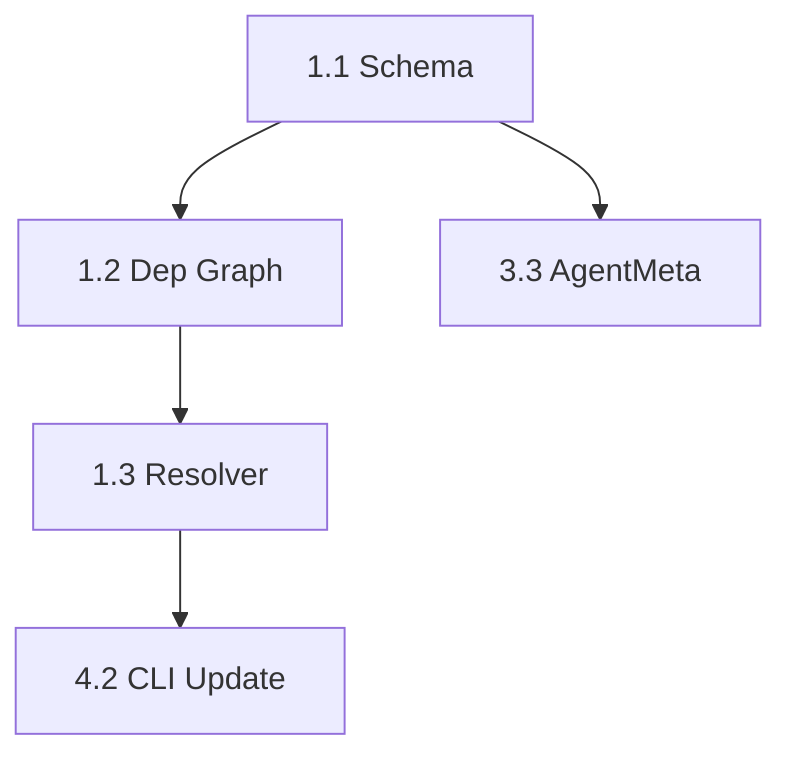

# Creating Refactoring Proposals - Detailed Guide

## Overview

This guide explains how to create effective refactoring proposals in the go-ent project, based on analysis of `docs/tools/`, `plugins/go-ent/agents/`, and real archived proposals.

---

## 1. Extension System Summary

### Three Extension Types

| Type | Location | Invocation | Format |
|------|----------|------------|--------|
| **Skills** | `.claude/skills/name/SKILL.md` | Auto-activated | Directory with SKILL.md |
| **Agents** | `.claude/agents/name.md` | `@ent:name` | Single .md file |
| **Commands** | `.claude/commands/name.md` | `/ent:name` | Single .md file |

### Agent Architecture (from `plugins/go-ent/agents/`)

```
agents/
├── meta/           # YAML configs with name, model, skills, tools
│   └── bases/      # Inheritance bases (debugger.yaml, planner.yaml, task.yaml)
├── presets/        # Tool presets (read-only, editing, serena-analysis)
├── prompts/shared/ # Constitutional AI prompts
├── schema/         # JSON Schema for validation
└── templates/      # Output templates for Claude/OpenCode
```

**Key Files:**
- `plugins/go-ent/agents/presets/tools.yaml` - Tool preset definitions
- `plugins/go-ent/agents/schema/agent.schema.json` - Agent metadata schema
- `plugins/go-ent/agents/prompts/shared/_principals.md` - Priority hierarchy
- `plugins/go-ent/agents/prompts/shared/_handoffs.md` - Delegation rules

---

## 2. OpenSpec Proposal Structure

### Directory Layout

```
openspec/changes/<change-id>/
├── proposal.md     # Required - What and why
├── tasks.md        # Required - Implementation breakdown
├── design.md       # Optional - Architecture decisions
└── specs/          # Optional - Spec deltas
```

### Naming Convention
- Directory: `kebab-case-description` (e.g., `refactor-skill-system`)
- Or dated: `YYYY-MM-DD-description` (e.g., `2026-01-22-refactor-agent-system`)

---

## 3. Proposal Template (proposal.md)

### Required Sections

```markdown
# Proposal: <Title>

## Status: pending

## Why
<Problem statement with metrics - LOC counts, file counts, concrete pain points>

## What Changes
<Technical description with before/after comparisons>

### Key Components
- `internal/path/file.go` - Description of change
- `internal/other/file.go` - Description of change

## Impact
<Breaking changes, migration needs, performance implications>

## Success Criteria
- [ ] Criterion 1 (measurable)
- [ ] Tests pass: `go test ./... -race`
- [ ] Build succeeds: `go build ./...`
- [ ] Lint passes: `make lint`

## Risk Assessment
| Risk | Severity | Mitigation |
|------|----------|------------|
| Risk 1 | Medium | How to handle |

## Alternatives Considered
1. **Alternative A** - Why rejected
```

### Real Example: Package Movement Refactor

From `openspec/changes/archive/2026-01-04-refactor-move-core-packages/proposal.md`:

```markdown
## Why
**Current Problem**:
- ~5000 lines of pure domain logic buried in `/cmd/go-ent/internal/`
- Three packages (`spec`, `template`, `generation`) have zero MCP dependencies

## What Changes
Before:
/cmd/go-ent/internal/
    ├── spec/           → Move to /internal/spec/
    ├── template/       → Move to /internal/template/

After:
/internal/
    ├── spec/           (moved)
    ├── template/       (moved)

**Moved (26 files)**:
- `cmd/go-ent/internal/spec/*.go` (14 files + tests)

**Import updates (14 files)**:
- `cmd/go-ent/internal/tools/archive.go`
```

---

## 4. Tasks Template (tasks.md)

### Required Sections

```markdown
# Tasks: <Same Title as Proposal>

## Status: pending

## Dependencies
- T1.1 → T1.2 → T1.3 (linear chain)
- T2.1 (parallel with T1.x)
- T1.3, T2.1 → T3.1 (merge point)

## Phase 1: <Phase Name>

### T1.1: <Task Title>
**Files:** `internal/path/file.go`
**Dependencies:** None
**Parallel with:** T1.2

Steps:
- [x] 1.1.1 First subtask
- [ ] 1.1.2 Second subtask

Validation:
- [ ] `make build` passes
- [ ] `grep -r "old_pattern" .` returns 0 matches

## Completion Summary
**Date:** YYYY-MM-DD
**Tasks Completed:** X/Y
```

### Task Metadata Fields

| Field | Format | Example |
|-------|--------|---------|
| Task ID | `T1.2` or `**1.2**` | `### T1.2: Move spec package` |
| Files | Full paths | `internal/agent/deps.go` |
| Dependencies | Task refs | `Depends: T1.1` |
| Parallel | Task refs | `Parallel with: 1.1` |
| Subtasks | Checkboxes | `- [x] 1.2.1 Move files` |
| Time estimate | Hours | `(2h)` |

### Real Example: Complex Refactor Tasks

From `openspec/changes/archive/2026-01-22-refactor-agent-command-skill-system/tasks.md`:

```markdown
## Dependencies
- None (independent refactoring)
- T1.1 → T1.2 → T1.3
- T2.1 (parallel with T1.x)
- T1.3, T2.1 → T3.1

### T1.2: Move spec package
- **Story**: proposal.md#Package Relocation
- **Files**: All files in `cmd/go-ent/internal/spec/`
- **Depends**: T1.1
- **Parallel**: No
- [x] 1.2.1 Move `cmd/go-ent/internal/spec/*.go` to `/internal/spec/`
- [x] 1.2.2 Move all test files (*_test.go) to `/internal/spec/`
- [x] 1.2.3 Update package declaration in all moved files

## Critical Path
Foundation: 1.2 → 1.3 → 1.4
              ↓
CLI Update: 4.2 → 4.3
**Longest Path**: 1.2 → 1.3 → 1.4 → 4.2 → 4.3 → 6.3
```

---

## 5. Creating a Refactoring Proposal - Step by Step

### Step 1: Quantify the Problem

```bash
# Count lines in target packages
find internal/old-package -name "*.go" | xargs wc -l

# Count affected files
find . -name "*.go" -exec grep -l "old_pattern" {} \; | wc -l

# List import dependencies
grep -r "internal/old-package" --include="*.go" | cut -d: -f1 | sort -u
```

### Step 2: Create Proposal Directory

```bash
mkdir -p openspec/changes/refactor-my-feature
```

### Step 3: Write proposal.md

**Essential elements:**
1. **Why** - Quantified problem (LOC, file count, concrete issues)
2. **What Changes** - Before/after directory trees
3. **Files Affected** - Explicit full paths
4. **Success Criteria** - Executable validation commands
5. **Risk Table** - Severity + mitigation

### Step 4: Write tasks.md

**Essential elements:**
1. **Dependency graph** - ASCII or Mermaid diagram
2. **Phased breakdown** - Group related tasks
3. **Per-task metadata** - Files, dependencies, parallel flags
4. **Subtask checkboxes** - Granular completion tracking
5. **Validation checkpoints** - `make build/test/lint` after each phase

### Step 5: Register and Execute

```bash
# Register in registry (automatic via /ent:plan)
# Or manually add to openspec/registry.yaml

# Execute tasks
/ent:apply
```

---

## 6. Dependency Expression Patterns

### Linear Chain
```markdown
T1.1 → T1.2 → T1.3
```

### Parallel Branches
```markdown
T1.1 ─┬→ T2.1 (parallel)
      └→ T2.2 (parallel)
```

### Merge Point
```markdown
T1.3, T2.1 → T3.1
```

### In-Task Reference
```markdown
### T2.3: Integration
**Dependencies:** T2.1, T2.2
**Parallel with:** T1.x
```

### Mermaid Diagram (for complex refactors)


---

## 7. Verification Patterns

### Per-Task Validation
```markdown
Validation:
- [ ] `make build` passes
- [ ] `make test` passes
- [ ] `grep -r "old_import" --include="*.go"` returns 0
```

### Phase Checkpoint
```markdown
## Phase 1 Checkpoint
- [ ] All Phase 1 tasks marked complete
- [ ] `go build ./...` succeeds
- [ ] `go test ./... -race` passes
- [ ] No regressions in existing functionality
```

### Final Verification
```markdown
## Completion Summary
**Date:** 2026-01-28
**Tasks Completed:** 19/19

### Final Checks
- [x] `make build` - PASS
- [x] `make test` - PASS
- [x] `make lint` - PASS (3 pre-existing warnings)
- [x] Manual smoke test - PASS
```

---

## 8. Common Refactoring Types

### Type A: Package Movement
- List source/destination paths explicitly
- Track all import updates
- Verify with `grep -r "old/import/path"`

### Type B: Code Cleanup
- Count LOC reduction
- Document pre-existing lint errors separately
- List each deletion explicitly

### Type C: Architecture Change
- Include design.md with diagrams
- Define migration phases
- Add backwards compatibility tasks

### Type D: Dependency Update
- List breaking API changes
- Include adaptation code examples
- Define rollback procedure

---

## 9. Key Files Reference

| File | Purpose |
|------|---------|
| `docs/tools/claude-code-extension-guide.md` | Claude Code extension format |
| `docs/tools/opencode-extension-guide.md` | OpenCode extension format |
| `plugins/go-ent/agents/meta/*.yaml` | Agent configurations |
| `plugins/go-ent/agents/presets/tools.yaml` | Tool preset definitions |
| `plugins/go-ent/agents/prompts/shared/_principals.md` | Priority hierarchy |
| `plugins/go-ent/agents/prompts/shared/_handoffs.md` | Delegation rules |
| `openspec/registry.yaml` | Change tracking registry |

---

## 10. Quick Checklist

### Before Writing
- [ ] Counted affected files/lines
- [ ] Listed all import dependencies
- [ ] Identified breaking changes
- [ ] Chose appropriate complexity level

### Proposal Quality
- [ ] Problem quantified with metrics
- [ ] Before/after structure shown
- [ ] All file paths explicit (not patterns)
- [ ] Risk table included
- [ ] Success criteria executable

### Tasks Quality
- [ ] Dependency graph defined
- [ ] Tasks phased logically
- [ ] Each task has files listed
- [ ] Subtasks are checkbox items
- [ ] Validation after each phase

### Ready to Execute
- [ ] No TBD/TODO markers remain
- [ ] Dependencies form DAG (no cycles)
- [ ] All files exist at specified paths
- [ ] Verification commands tested

---

**See Also:**
- `docs/AGENT_SYSTEM_AND_PROPOSALS.md` - Comprehensive agent and proposal system guide
- `docs/DEVELOPMENT.md` - Development workflows and setup
- `openspec/changes/archive/` - Real completed proposal examples
