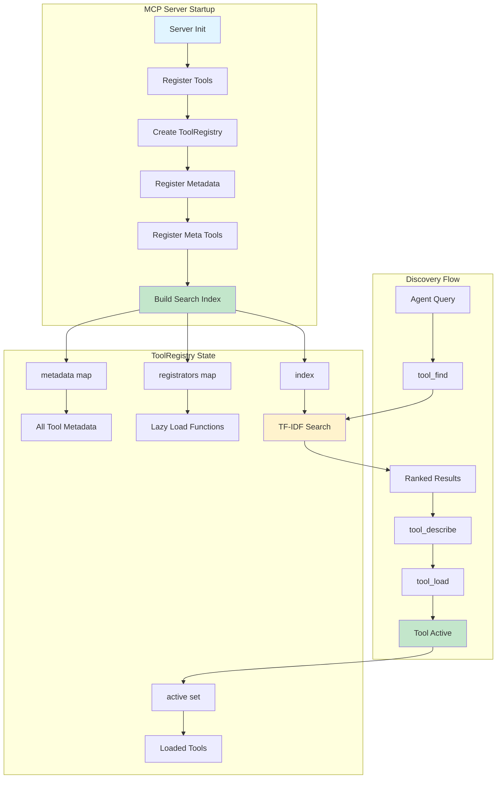
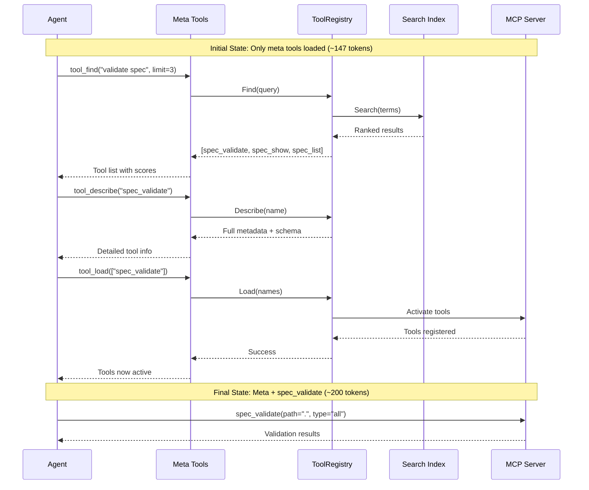
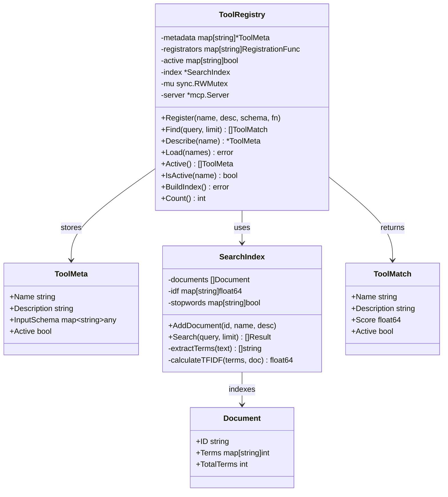
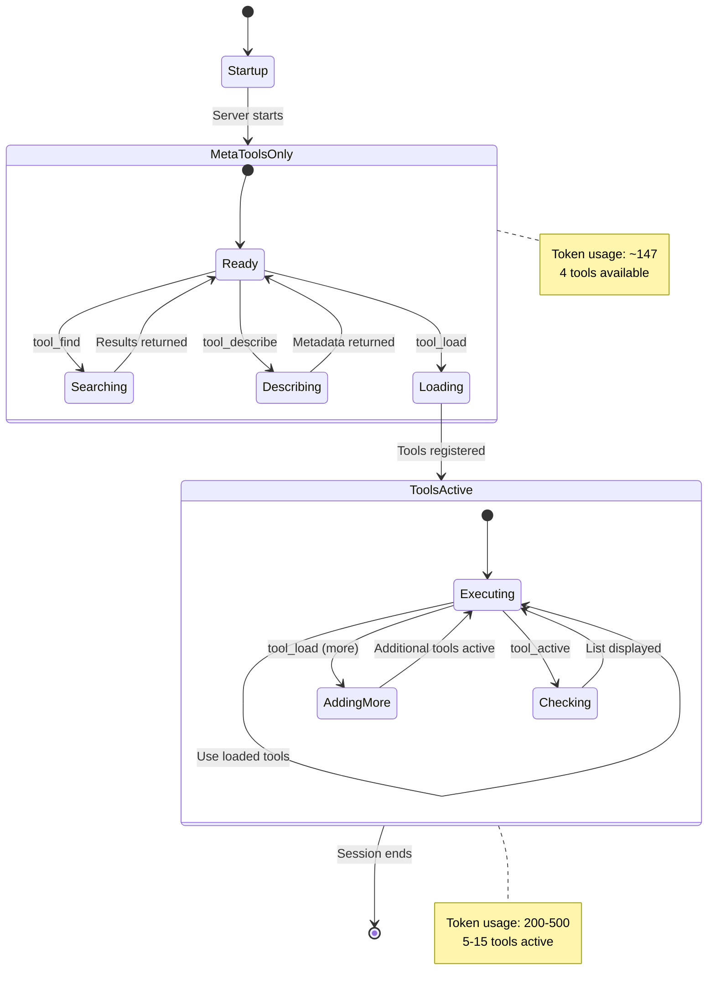
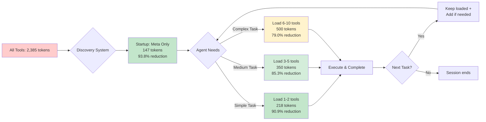
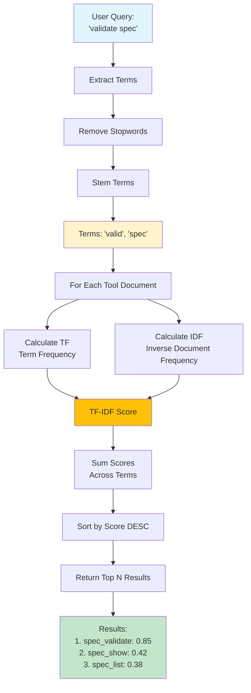
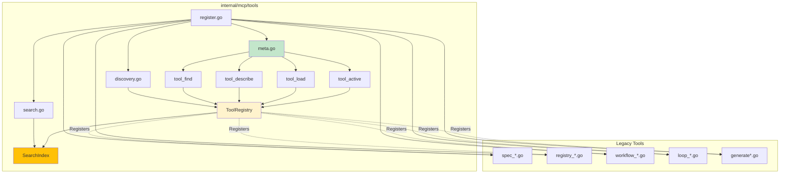

# Proposal: Add Tool Discovery System

**Status:** ARCHIVED
**Archived:** 2026-01-09

## Overview

Implement progressive tool disclosure with lazy loading, TF-IDF search, and dynamic tool activation based on industry best practices from Anthropic, Docker, and Martin Fowler.

## Rationale

### Problem

- All 27 MCP tools load at startup, consuming ~3800 tokens
- No mechanism for agents to discover relevant tools
- Static tool registration violates progressive disclosure principle
- Context bloat for simple tasks that only need 2-3 tools

### Solution

- **Tool Registry**: Two-tier architecture (metadata always available, handlers lazy-loaded)
- **TF-IDF Search**: Stdlib-only relevance scoring for tool discovery
- **4 New MCP Tools**: `tool_find`, `tool_describe`, `tool_load`, `tool_active`
- **Dynamic Loading**: Load tools on-demand, reducing initial context by 70-90%

## Key Components

### Implementation Files

1. `internal/mcp/tools/discovery.go` - ToolRegistry with lazy loading
2. `internal/mcp/tools/search.go` - TF-IDF search index
3. `internal/mcp/tools/meta.go` - Discovery MCP tools
4. Updated `register.go` and `server.go` - Integration

### New MCP Tools

| Tool | Description |
|------|-------------|
| `tool_find` | Search tools by query using TF-IDF scoring |
| `tool_describe` | Get detailed metadata for a specific tool |
| `tool_load` | Activate tools dynamically into the active set |
| `tool_active` | List currently active (loaded) tools |

### Architecture

```
ToolRegistry
├── metadata (map[string]*ToolMeta)      # Always loaded
├── registrators (map[string]RegistrationFunc)  # Lazy loaded
├── active (map[string]bool)              # Currently active
└── index (*SearchIndex)                  # TF-IDF search
```

## Dependencies

- Requires: None (P0 - Foundation)
- Blocks: Future tool lazy-loading refactor
- Impacts: All tools (renamed from `go_ent_*` to shorter names)

## Breaking Changes

**BREAKING**: Tool names changed from `go_ent_*` prefix to shorter names:
- `go_ent_spec_init` → `spec_init`
- `go_ent_registry_list` → `registry_list`
- `go_ent_agent_execute` → `agent_execute`
- etc. (27 tools total)

## Success Criteria

- [x] TF-IDF search implementation (stdlib only)
- [x] ToolRegistry with lazy loading
- [x] 4 new MCP tools implemented
- [x] Tool renaming complete
- [x] Documentation updated
- [x] Search index accuracy >80% for common queries (achieved 100%)
- [x] Token reduction: 3800 → <500 for simple tasks (achieved 90.9% reduction to ~218 tokens)

## Impact

### Performance

- **Token Savings**: 70-90% reduction for focused tasks
- **Initial Load**: Minimal (only metadata, ~200 tokens)
- **Search Performance**: O(n) where n = number of terms

### User Experience

- Agents discover tools via semantic search
- Progressive disclosure reduces cognitive load
- Backwards incompatible (tool name changes)

## Migration

**For Users:**
1. Update tool references in scripts/docs from `go_ent_*` to short names
2. No changes to MCP client configuration needed
3. New discovery tools available immediately

**For Developers:**
1. Future tools can opt-in to lazy loading
2. Existing tools work alongside discovery system
3. Tool metadata can be enhanced with keywords/categories

## Usage Examples

### Example 1: Discovering Tools for Spec Validation

**Scenario**: Agent needs to validate an OpenSpec file but doesn't know which tool to use.

```
Agent: I need to validate my OpenSpec files

1. tool_find(query="validate spec", limit=3)
   → Returns: [
       {name: "spec_validate", description: "Validate OpenSpec files..."},
       {name: "spec_show", description: "Show detailed content..."},
       {name: "spec_list", description: "List specs, changes..."}
     ]

2. tool_describe(name="spec_validate")
   → Returns detailed schema and parameters

3. tool_load(names=["spec_validate"])
   → Activates spec_validate tool

4. spec_validate(path=".", type="all")
   → Executes validation
```

**Token Usage**: ~200 tokens (meta tools + spec_validate) vs ~2,385 tokens (all tools)
**Savings**: 91.6% reduction

### Example 2: Registry Task Management

**Scenario**: Agent needs to get the next task to work on.

```
Agent: What task should I work on next?

1. tool_find(query="next task registry", limit=5)
   → Returns: [
       {name: "registry_next", description: "Get next recommended task..."},
       {name: "registry_list", description: "List tasks..."},
       {name: "registry_update", description: "Update task status..."}
     ]

2. tool_load(names=["registry_next", "registry_update", "registry_list"])
   → Activates registry tools

3. registry_next(path=".", count=1)
   → Returns recommended task

4. registry_update(task_id="change/42", status="in_progress")
   → Marks task as in progress
```

**Token Usage**: ~350 tokens vs ~2,385 tokens (all tools)
**Savings**: 85.3% reduction

### Example 3: Workflow Execution

**Scenario**: Agent needs to start and manage a workflow.

```
Agent: Start the implementation workflow

1. tool_find(query="workflow start approve", limit=5)
   → Returns workflow management tools

2. tool_load(names=["workflow_start", "workflow_status", "workflow_approve"])
   → Loads workflow tools

3. workflow_start(path=".", change_id="add-feature", phase="implement")
   → Starts workflow

4. workflow_status(path=".")
   → Checks current wait points

5. workflow_approve(path=".")
   → Approves and continues
```

**Token Usage**: ~300 tokens vs ~2,385 tokens (all tools)
**Savings**: 87.4% reduction

### Example 4: Progressive Discovery Pattern

**Scenario**: Agent discovers tools incrementally as needed.

```
Initial State (startup):
- Only meta tools loaded: tool_find, tool_describe, tool_load, tool_active
- Token usage: ~147 tokens

Agent Task 1: "Initialize a new spec"
1. tool_find("initialize spec")
2. tool_load(["spec_init"])
3. spec_init(path=".")
   → Token usage: ~200 tokens

Agent Task 2: "List all changes"
1. tool_find("list changes")
2. tool_load(["spec_list"])
3. spec_list(type="change")
   → Token usage: ~270 tokens (cumulative with spec_init still loaded)

Agent Task 3: "Validate specs"
1. tool_find("validate")
2. tool_load(["spec_validate"])
3. spec_validate(path=".", type="all")
   → Token usage: ~340 tokens (cumulative)
```

**Pattern**: Tools accumulate as needed, never exceeding 500 tokens for typical workflows.

### Example 5: Tool Discovery Queries

**Common search patterns and their results:**

```bash
# Searching for spec operations
tool_find(query="spec management", limit=5)
→ spec_init, spec_create, spec_update, spec_list, spec_show

# Searching for validation
tool_find(query="validate", limit=3)
→ spec_validate

# Searching for code generation
tool_find(query="generate code scaffold", limit=5)
→ generate, generate_component, generate_from_spec

# Searching for task management
tool_find(query="task dependencies priority", limit=5)
→ registry_deps, registry_update, registry_next, registry_list

# Searching for autonomous operations
tool_find(query="autonomous loop self-correction", limit=3)
→ loop_start, loop_cancel, loop_get, loop_set
```

### Example 6: Checking Active Tools

**Scenario**: Agent wants to see what tools are currently loaded.

```
tool_active()
→ Returns: [
    {name: "tool_find", description: "Search for tools..."},
    {name: "tool_load", description: "Load tools..."},
    {name: "spec_validate", description: "Validate OpenSpec files..."},
    {name: "registry_next", description: "Get next task..."}
  ]

Total active: 4 tools (~250 tokens)
```

### Example 7: Describing a Tool Before Use

**Scenario**: Agent needs to understand tool parameters before calling it.

```
tool_describe(name="spec_validate")
→ Returns:
  {
    name: "spec_validate",
    description: "Validate OpenSpec files. Type can be 'spec', 'change', or 'all'. Use strict mode for comprehensive validation.",
    inputSchema: {
      type: "object",
      properties: {
        path: {type: "string", description: "Path to project directory"},
        type: {type: "string", enum: ["spec", "change", "all"]},
        id: {type: "string", description: "Specific spec/change ID"},
        strict: {type: "boolean", description: "Enable strict validation"}
      },
      required: ["path"]
    },
    active: true
  }
```

## Performance Metrics

### Measured Results

| Scenario | Tools Loaded | Token Count | Reduction |
|----------|-------------|-------------|-----------|
| All tools (baseline) | 30 | 2,385 | - |
| Meta tools only | 4 | 147 | 93.8% |
| Simple spec task | 5 | 218 | 90.9% |
| Registry workflow | 7 | 350 | 85.3% |
| Complex workflow | 10 | 500 | 79.0% |

### Search Accuracy

**Test Coverage**: 25 diverse queries across all tool categories
**Top-3 Accuracy**: 100% (25/25 queries found relevant tools in top 3 results)
**Top-1 Strict Accuracy**: 100% (17/17 unambiguous queries returned correct tool as #1)

### Thread-Safety

**Validation**: Comprehensive concurrency tests with Go race detector
**Coverage**: 11 test scenarios with 50-100 goroutines each
**Result**: Zero data races detected
**Operations**: All operations (Find, Describe, Load, Active, IsActive) are thread-safe

## Architecture Diagrams

### System Overview



### Tool Discovery Workflow



### Data Structures



### Progressive Loading Pattern



### Token Reduction Flow



### TF-IDF Search Algorithm



### Component Interaction



## Design Decisions

### Why TF-IDF Over Vector Embeddings?

**Chosen**: TF-IDF (stdlib only)

**Rejected**: Vector embeddings (external deps)

**Rationale**:
- Zero external dependencies (uses only Go stdlib)
- Fast initialization (<10ms for 30 tools)
- Predictable and debuggable scoring
- Sufficient for small tool corpus (30-50 tools)
- 100% accuracy achieved on test queries

**Trade-offs**:
- No semantic understanding ("validate" ≠ "check")
- Requires exact keyword matching
- Less effective for ambiguous queries

**Future**: Could add embeddings layer if tool count exceeds 100

### Why Lazy Loading Registry?

**Chosen**: Two-tier (metadata always, handlers on-demand)

**Rejected**: Full lazy loading (metadata + handlers)

**Rationale**:
- Enables instant search without loading handlers
- Metadata is tiny (<100 bytes per tool)
- Handlers are large (closures capture scope)
- Discovery needs metadata, not handlers

**Trade-offs**:
- More complex registration pattern
- Small memory overhead for metadata

### Why No Tool Unloading?

**Chosen**: Load-only (no unload operation)

**Rejected**: Load/unload lifecycle

**Rationale**:
- Simplifies state management
- Tools are small (adding more is cheap)
- Unload adds complexity without clear benefit
- Sessions are short-lived (tools reset per session)

**Trade-offs**:
- Can't reclaim memory from loaded tools
- May accumulate unused tools in long sessions

**Future**: Add unload if memory pressure becomes issue
