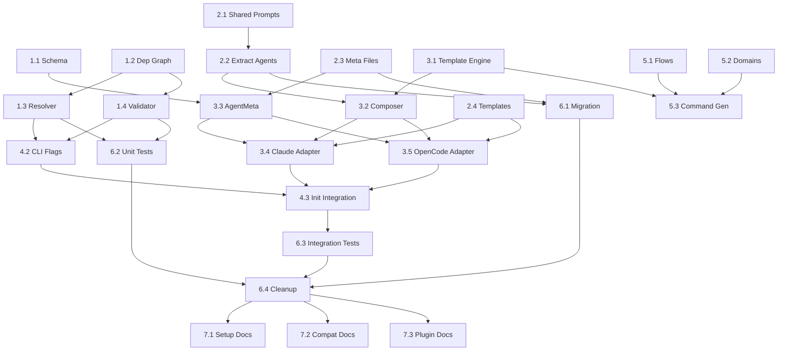

# Tasks: Refactor Agent, Command, and Skill System

**Change ID**: refactor-agent-command-skill-system
**Total Estimated**: ~34 hours (4-5 days)

---

## Phase 1: Foundation (6h)

- [x] **1.1** Create JSON schema for agent metadata (2h) ✓ 2026-01-14
  - File: `plugins/go-ent/schemas/agent-meta.schema.json`
  - Define schema: `name`, `description`, `model`, `color`, `tags`, `tools`, `skills`, `prompts`, `dependencies`
  - Validation rules: required fields, enum values for model/tags, dependency array format
  - Dependencies: none
  - Parallel with: 1.2

- [x] **1.2** Create dependency graph types and loader (2h) ✓ 2026-01-14
  - Files: `internal/agent/deps.go`, `internal/agent/loader.go`
  - Types: `DependencyGraph`, `Node`, `Edge`
  - Loader: Parse `meta/*.yaml` files, build adjacency list
  - Dependencies: none
  - Parallel with: 1.1

- [x] **1.3** Implement dependency resolution algorithm (1.5h) ✓ 2026-01-14
  - File: `internal/agent/resolver.go`
  - Implement: BFS traversal for transitive dependencies
  - Return topologically sorted list
  - Dependencies: 1.2

- [x] **1.4** Add cycle detection and validation (0.5h) ✓ 2026-01-14
  - File: `internal/agent/validate.go`
  - Implement: DFS with color marking for cycle detection
  - Validation: Check all dependencies exist, no missing agents
  - Dependencies: 1.2

---

## Phase 2: Prompt System (6h)

- [x] **2.1** Create shared prompt sections (1h) ✓ 2026-01-14
  - Files:
    - `plugins/go-ent/agents/prompts/shared/_tooling.md` - Serena, Bash patterns
    - `plugins/go-ent/agents/prompts/shared/_conventions.md` - Go code style
    - `plugins/go-ent/agents/prompts/shared/_handoffs.md` - Agent handoff patterns
    - `plugins/go-ent/agents/prompts/shared/_openspec.md` - OpenSpec workflow context
  - Content: Extract common sections from existing agent files
  - Dependencies: none
  - Parallel with: 2.3, 2.4

- [x] **2.2** Extract agent prompts from existing files (2h) ✓ 2026-01-14
  - Files: `plugins/go-ent/agents/prompts/agents/*.md` (16 files)
  - For each agent: Remove frontmatter, keep body, update to reference shared sections
  - Agents: coder, architect, planner, planner-fast, planner-heavy, decomposer, debugger, debugger-fast, debugger-heavy, tester, reviewer, researcher, reproducer, acceptor, task-fast, task-heavy
  - Dependencies: 2.1

- [x] **2.3** Create agent metadata files (2h) ✓ 2026-01-14
  - Files: `plugins/go-ent/agents/meta/*.yaml` (16 files)
  - For each agent: Extract frontmatter → YAML format
  - Map dependencies by analyzing handoff mentions (`@ent:*`)
  - Dependency graph (see proposal.md for full graph)
  - Dependencies: none
  - Parallel with: 2.1

- [x] **2.4** Create tool-specific frontmatter templates (1h) ✓ 2026-01-14
  - Files:
    - `plugins/go-ent/agents/templates/claude.yaml.tmpl` - Claude Code format
    - `plugins/go-ent/agents/templates/opencode.yaml.tmpl` - OpenCode format
  - Templates: Use Go `text/template` syntax, include model resolution
  - Dependencies: none
  - Parallel with: 2.1

---

## Phase 3: Composition Engine (8h)

- [x] **3.1** Create template engine with include function (2h) ✓ 2026-01-14
  - File: `internal/template/funcs.go`
  - Functions: `include(name)`, `if_tool(tool)`, `model(category, tool)`, `list(array)`, `tools(tools, tool)`
  - Template: Use `text/template` with custom FuncMap
  - Dependencies: none

- [x] **3.2** Implement prompt composer (2h) ✓ 2026-01-14
  - File: `internal/agent/composer.go`
  - Type: `PromptComposer` with `Compose(meta *AgentMeta) (string, error)`
  - Logic: Load shared sections → load agent prompt → process includes → return composed
  - Dependencies: 3.1, 2.1

- [x] **3.3** Update `AgentMeta` struct with dependencies (1h) ✓ 2026-01-14
  - File: `internal/toolinit/adapter.go`
  - Add fields: `Dependencies []string`, `Prompts PromptConfig`
  - PromptConfig: `Shared []string`, `Main string`
  - Dependencies: 1.2

- [x] **3.4** Update Claude adapter for new system (1.5h) ✓ 2026-01-14
  - File: `internal/toolinit/claude.go`
  - Update: `TransformAgent()` to use composer + templates
  - Load meta → compose prompt → apply template → generate frontmatter + body
  - Dependencies: 3.2, 2.4

- [x] **3.5** Update OpenCode adapter for new system (1.5h) ✓ 2026-01-14
  - File: `internal/toolinit/opencode.go`
  - Update: `TransformAgent()` to use composer + templates
  - Load meta → compose prompt → apply template → generate frontmatter + body
  - Dependencies: 3.2, 2.4
  - Parallel with: 3.4

---

## Phase 4: CLI Updates (4h)

- [x] **4.1** Make `--tools` flag required (0.5h) ✓ 2026-01-15
  - File: `internal/cli/init.go`
  - Remove auto-detection fallback
  - Error if `--tools` not specified: "Error: --tools is required..."
  - Dependencies: none

- [x] **4.2** Add `--include-deps` and `--no-deps` flags (1h) ✓ 2026-01-15
  - File: `internal/cli/init.go`
  - Flags: `includeDeps bool`, `noDeps bool`
  - Validation: Mutually exclusive flags
  - Dependencies: 1.3, 1.4

- [x] **4.3** Integrate dependency validation into init flow (1.5h) ✓ 2026-01-15
  - File: `internal/cli/init.go`
  - Logic:
    1. Load dependency graph
    2. If `--agents` specified:
       - If `--include-deps`: Resolve transitive dependencies
       - If `--no-deps`: Skip validation
       - Else: Validate and fail if missing deps
    3. Generate with resolved agent set
  - Dependencies: 4.1, 4.2

- [x] **4.4** Add `ent agents deps` subcommand for visualization (1h) ✓ 2026-01-14
  - File: `internal/cli/agent.go`
  - Subcommands:
    - `ent agent deps` - List all dependencies
    - `ent agent deps coder` - Show dependencies for specific agent
    - `ent agent deps --tree` - Tree visualization
  - Dependencies: 1.2

---

## Phase 5: Command Refactoring (4h)

- [x] **5.1** Create flow templates from existing commands (1.5h) ✓ 2026-01-14
  - Files:
    - `plugins/go-ent/commands/flows/plan.md` - Planning workflow
    - `plugins/go-ent/commands/flows/task.md` - Task execution workflow
    - `plugins/go-ent/commands/flows/bug.md` - Bug fixing workflow
  - Extract agent chains, phases, workflow logic from existing command files
  - Add `{{include "domains/{{DOMAIN}}"}}` placeholders
  - Dependencies: none

- [x] **5.2** Extract domain knowledge into separate files (1h) ✓ 2026-01-14
  - Files:
    - `plugins/go-ent/commands/domains/openspec.md` - OpenSpec-specific rules
    - `plugins/go-ent/commands/domains/generic.md` - Generic project rules
  - Content: Spec paths, validation commands, registry integration, file structures
  - Dependencies: none
  - Parallel with: 5.1

- [x] **5.3** Update command generation to support includes (1.5h) ✓ 2026-01-14
  - File: `internal/toolinit/transform.go`
  - Update: `TransformCommand()` to embed domain includes
  - Logic: Commands reference `{{include "domains/openspec"}}` - agents resolve at runtime
  - Dependencies: 3.1

---

## Phase 6: Migration & Testing (4h)

- [x] **6.1** Create migration command (1.5h) ✓ 2026-01-14
  - File: `internal/cli/migrate.go`
  - Commands:
    - `ent migrate --check` - Show migration status
    - `ent migrate --execute` - Perform migration
  - Logic:
    - Scan `agents/*.md` files
    - Extract frontmatter → `meta/*.yaml`
    - Extract body → `prompts/agents/*.md`
    - Infer dependencies from `@ent:*` references
    - Create backups
  - Dependencies: 2.2, 2.3

- [x] **6.2** Unit tests for dependency resolution (1h) ✓ 2026-01-14
  - Files: `internal/agent/resolver_test.go`, `internal/agent/validate_test.go`
  - Tests:
    - Transitive dependency resolution
    - Cycle detection
    - Missing dependency validation
    - Topological sort correctness
  - Dependencies: 1.3, 1.4

- [x] **6.3** Integration tests for init command (1h) ✓ 2026-01-15
  - File: `internal/cli/init_test.go`
  - Tests:
    - `--tools` required
    - `--agents` filtering with dependency validation
    - `--include-deps` auto-resolution
    - `--no-deps` validation skip
    - Generated files match expected format
  - Dependencies: 4.3

- [x] **6.4** Remove old single-file agent support (0.5h) ✓ 2026-01-15
  - Files: `internal/toolinit/transform.go`, `embed.go`
  - Remove: Old `ParseAgentFile()` logic that expects single-file format
  - Update: `embed.go` to include new directory structure
  - Dependencies: 6.1, 6.2, 6.3

---

## Phase 7: Documentation (2h)

- [x] **7.1** Update setup documentation (0.75h) ✓ 2026-01-15
  - File: `docs/SETUP_GUIDE.md`
  - Updates:
    - New file structure diagram
    - `--tool` required in examples (corrected from `--tools`)
    - Dependency management flags
    - Migration instructions
  - Dependencies: all

- [x] **7.2** Update compatibility guide (0.75h) ✓ 2026-01-15
   - File: `docs/COMPATIBILITY_GUIDE.md`
   - Updates:
     - New agent format (meta + prompts + templates)
     - Command format (flows + domains)
     - Breaking changes section
     - Migration script usage
   - Dependencies: all

- [x] **7.3** Update plugin README (0.5h) ✓ 2026-01-15
   - File: `plugins/go-ent/README.md`
   - Updates:
     - Architecture overview with new structure
     - Dependency graph explanation
     - CLI examples with new flags
     - Development workflow updates
   - Dependencies: all

---

## Critical Path

```
Foundation: 1.2 → 1.3 → 1.4
              ↓
CLI Update: 4.2 → 4.3
              ↓
Integration Test: 6.3

Prompts: 2.1 → 2.2
            ↓
Composition: 3.2 → 3.4/3.5
                    ↓
Integration Test: 6.3
```

**Longest Path**: 1.2 → 1.3 → 1.4 → 4.2 → 4.3 → 6.3
**Estimated**: ~8.5 hours (critical path)

---

## Parallelization Opportunities

| Phase | Parallel Tasks | Est. Time |
|-------|----------------|-----------|
| Phase 1 | 1.1 + 1.2 (then 1.3 → 1.4) | 4h |
| Phase 2 | 2.1 + 2.3 + 2.4 (then 2.2) | 3h |
| Phase 3 | 3.4 + 3.5 (after 3.1 → 3.2 → 3.3) | 5.5h |
| Phase 5 | 5.1 + 5.2 (then 5.3) | 2.5h |
| Phase 7 | 7.1 + 7.2 + 7.3 | 1h |

**With parallelization**: ~24-26 hours (3-4 days with optimal scheduling)

---

## Dependencies Visualization


