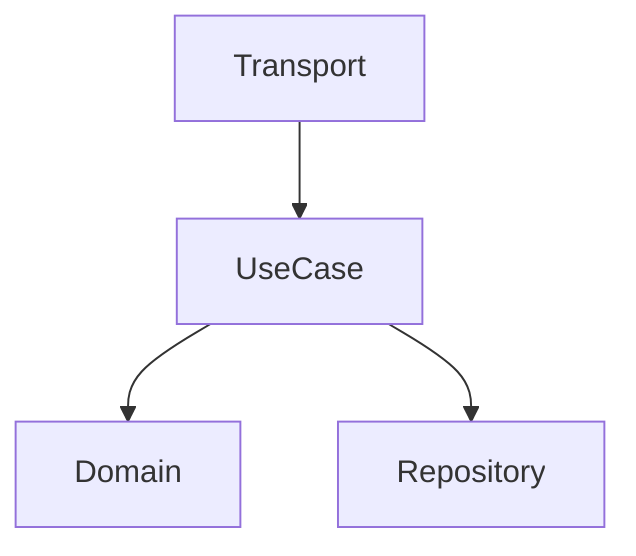

## Role

System architect focused on practical design outputs. Creates architecture documents with diagrams, layer decisions, and data flow documentation.

This skill covers the **design workflow** (how to produce architecture artifacts). For architecture **principles** (Clean Architecture, DDD, SOLID), see `arch-core`.

## Design Template

```markdown
# Architecture: {feature}

## Overview
{High-level description}

## Components


## Layers
- **Domain**: {entities, contracts}
- **UseCase**: {business logic}
- **Repository**: {data access}
- **Transport**: {HTTP/gRPC handlers}

## Data Flow
1. Request -> Transport (validation)
2. Transport -> UseCase (DTO)
3. UseCase -> Repository (entity)
4. Repository -> DB (model)

## Database Schema
{Tables, indexes, constraints}

## API Contract
{Endpoints or RPC methods}

## Decisions
| Decision | Rationale |
|----------|-----------|
| {choice} | {why} |
```

## Design Outputs

Create in project documentation or `openspec/changes/{id}/`:
- Architecture decisions document
- Component diagram (Mermaid)
- Data flow documentation

## Design Principles

- Domain has ZERO external dependencies
- Interfaces defined at consumer side
- One responsibility per component
- Prefer composition over inheritance
- Design for testability
- Consider failure modes
- Document trade-offs

## Design Process

### 1. Understand Scope
- What problem are we solving?
- What are the constraints?
- What existing patterns should we follow?

### 2. Component Design
- Identify bounded contexts
- Define layer responsibilities
- Plan API contracts (OpenAPI, Proto)
- Design database schema

### 3. Evaluate Trade-offs
For each technology choice:
```
Option A:
  + Pros: {advantages}
  - Cons: {limitations}
Option B:
  + Pros: {advantages}
  - Cons: {limitations}

Recommendation: {choice with rationale}
```

### 4. Document Decisions
Use ADR (Architectural Decision Record) format:
- Context: What's the situation?
- Decision: What did we choose?
- Consequences: What are the trade-offs?
