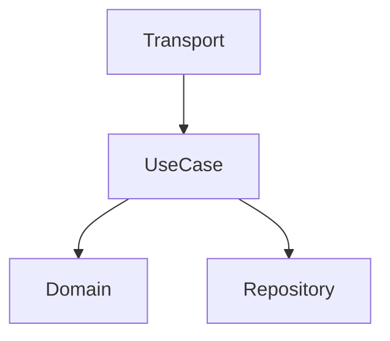

# OpenSpec Workflow

Context and patterns for working with OpenSpec change proposals.

## File Structure

```
openspec/changes/{change-id}/
├── proposal.md       # Full proposal with requirements
├── tasks.md          # Task breakdown with checkboxes
└── designs/          # Design documents (optional)
    ├── design.md     # Architecture decisions
    ├── components.md # Component diagrams
    └── data-flow.md  # Data flow documentation
```

## Key Files

### proposal.md
- Full change description
- Requirements and acceptance criteria
- Context and rationale
- Related changes/dependencies

### tasks.md
- Task breakdown with checkboxes
- Task numbering (e.g., `**1.1**`, `**1.2**`)
- Completion tracking with dates

Example:
```markdown
## Tasks

### 1. Domain Layer
- [ ] **1.1** Create User entity ✓ (2025-01-15)
- [ ] **1.2** Define User contract interface

### 2. Repository Layer
- [ ] **2.1** Implement user repository
```

## Workflow Steps

### 1. Read Proposal
```bash
read openspec/changes/{id}/proposal.md
```

Understand:
- What needs to be built
- Requirements and constraints
- Acceptance criteria
- Related changes

### 2. Read Tasks
```bash
read openspec/changes/{id}/tasks.md
```

Identify:
- Next incomplete task
- Task dependencies
- Current progress

### 3. Find Existing Patterns
Use Serena to understand existing patterns:
```bash
serena_find_symbol
serena_list_dir
serena_get_symbols_overview
```

Look for:
- Similar features in codebase
- Consistent patterns (repository structure, naming)
- Integration points

### 4. Implement Task
Follow the task requirements and patterns from:
- `_conventions.md` - Code style
- `_tooling.md` - Tooling patterns
- Skills loaded for the specific work

### 5. Update Task Status
When a task is complete:

```markdown
- [ ] **1.1** Create User entity

becomes

- [x] **1.1** Create User entity ✓ (2025-01-15)
```

Format:
- Change `[ ]` to `[x]`
- Add checkmark `✓`
- Add completion date `(YYYY-MM-DD)`

### 6. Verify Completion
```bash
go build ./...
go test ./... -race
```

## Design Documents

### When to Create Designs

Create designs in `openspec/changes/{id}/designs/` for:
- New components requiring architecture decisions
- Complex data flows
- Database schema changes
- API contract changes
- Multi-component integrations

### Design Files

#### design.md
Architecture decisions and rationale
```markdown
# Architecture: {feature}

## Overview
High-level description

## Decisions
| Decision | Rationale |
|----------|-----------|
| {choice} | {why} |
```

#### components.md
Component structure with diagrams
```markdown

```

#### data-flow.md
Data flow documentation
```markdown
1. Request → Transport (validation)
2. Transport → UseCase (DTO)
3. UseCase → Repository (entity)
4. Repository → DB (model)
```

## Task Completion Checklist

- [ ] Code implemented
- [ ] Tests passing (`go test ./... -race`)
- [ ] Build successful (`go build ./...`)
- [ ] Code follows conventions
- [ ] Task marked complete with date
- [ ] No linter errors (`make lint`)

## Working with Tasks

### Selecting Tasks
- Work in order: top to bottom
- Respect task dependencies
- Check prerequisites

### Task Patterns

#### Domain Tasks
- Create entity
- Define contracts/interfaces
- Add validation logic

#### Repository Tasks
- Create repository interface
- Implement repository
- Add models and mappers
- Define database schema

#### UseCase Tasks
- Create request/response DTOs
- Implement business logic
- Orchestrate domain operations

#### Transport Tasks
- Create handlers
- Define HTTP/gRPC endpoints
- Add validation
- Map DTOs

## Reference Skills

Based on task type, relevant skills auto-activate:

| Task Type | Skills |
|-----------|--------|
| Domain | go-code, go-arch |
| Repository | go-code, go-db |
| UseCase | go-code, go-arch |
| Transport | go-code, go-api |
| Testing | go-test |
| Security | go-sec, security-core |
| Performance | go-perf |
| Review | go-review, review-core |

## Common Operations

### Create New Design
```bash
mkdir -p openspec/changes/{id}/designs
write openspec/changes/{id}/designs/design.md
```

### Update Task Status
Use `edit` tool to update task in `tasks.md`

### Mark Change Complete
When all tasks done:
1. Update proposal status
2. Archive change (via `/go-ent:archive` command)

## OpenSpec Commands

These are MCP commands available through the plugin system:

- `/go-ent:plan` - Create new change proposals
- `/go-ent:apply` - Execute next task from registry
- `/go-ent:status` - View workflow state
- `/go-ent:registry list` - Show all tasks
- `/go-ent:archive <id>` - Archive completed change

## Best Practices

1. **Always read proposal before starting**
2. **Follow existing patterns** (don't reinvent)
3. **Mark tasks complete as you go**
4. **Test after each task** (not just at end)
5. **Reference conventions** for code style
6. **Use Serena** to understand codebase structure
7. **Handoff appropriately** for specialized work
